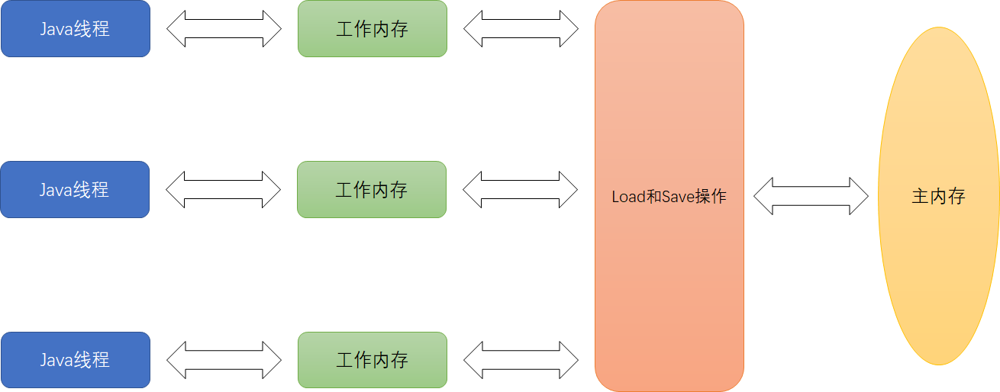

## 一、线程的状态

<div style="display:flex;justify-content: center; align-items:center; width: 100%;text-align:center;line-height:40px ">
    <div style="font-weight:bold">从操作系统层面划分</div>
</div>


---

<div style="display:flex;justify-content: center; align-items:center; width: 100%;text-align:center;line-height:40px ">
    <div style="font-weight:bold">从java代码的角度来进行划分</div>
</div>


## 二、JDK创建线程的方式

- 继承Thread类

```java
public class ThreadTest {
  public static void main(String[] args) {
    Thread thread = new ThreadDemo();
    thread.start();
  }
}

class ThreadDemo extends Thread {
  @Override
  public void run() {
    System.out.println("do something");
  }
}
```

- 实现Runnable接口

```java
public class ThreadTest {
  public static void main(String[] args) {
    Thread thread = new Thread(new RunnableDemo());
    thread.start();
  }
}

class RunnableDemo implements Runnable {
  @Override
  public void run() {
    System.out.println("do something");
  }
}
```

- 实现Callable接口携带返回值

```java
public class ThreadTest {
  public static void main(String[] args) throws Exception {
    FutureTask<String> futureTask = new FutureTask<>(new CallableDemo());
    Thread thread = new Thread(futureTask);
    thread.start();     //此时Callable接口已经被调用
    String result = futureTask.get();
    System.out.println(result);
  }
}

class CallableDemo implements Callable<String> {
  @Override
  public String call() throws Exception {
    return "do something";
  }
}
```

- 定时器

```java
public class ThreadTest {
  public static void main(String[] args) {
    Timer timer = new Timer();
    timer.schedule(new TimerTaskDemo(),1000);
  }
}

class TimerTaskDemo extends TimerTask {
  @Override
  public void run() {
    System.out.println("do something");
  }
}
```

- 线程池

```java
public class ThreadTest {
  public static void main(String[] args) {
    ExecutorService executor = Executors.newFixedThreadPool(5);
    executor.execute(new ExecutorDemo());
    executor.shutdown();	//线程池销毁，正在执行和在队列等待的线程不会销毁
  }
}

class ExecutorDemo implements Runnable {
  @Override
  public void run() {
    System.out.println("do something");
  }
}
```

## 三、线程带来的风险

### 线程安全性问题

**出现线程安全性问题的条件**

1. 在多线程的环境下
2. 必须有共享资源
3. 对共享资源进行非原子性操作

---

**解决线程安全性问题的方法**

- 针对多个线程操作同一共享资源<span style="color:Gold">——</span>不共享资源（ThreadLocal、不共享、操作无状态化、不可变）
- 针对多个线程进行非原子性操作<span style="color:Gold">——</span>将非原子性操作改成原子性操作（使用加锁机制来保证可见性和有序性以及原子性、使用JDK自带的原子性操作的类、JUC提供的相应的并发工具类）

### 活跃性问题

**死锁问题**

指两个或两个以上的进程（或线程）在执行过程中，因争夺资源而造成的一种互相等待的现象（至少两个资源），若无外力作用，它们都将无法推进下去。此时称系统处于死锁状态或系统产生了死锁，这些永远在互相等待的进程称为死锁进程。

> 比喻解释：有两根筷子，线程A和线程B都抢到了一个，互不相让
>
> 

```java
public class DeadLockTest {

  public static final Object resource1 = new Object();
  public static final Object resource2 = new Object();

  public static void main(String[] args) {

    new Thread(() -> {
      synchronized (resource1) {
        try {
          Thread.sleep(500);
        } catch (InterruptedException e) {
          e.printStackTrace();
        }
        System.out.println(Thread.currentThread().getName() + "：等待");
        synchronized (resource2) {
          System.out.println(Thread.currentThread().getName() + "：可以执行");
        }
      }
    }, "A").start();

    new Thread(() -> {
      synchronized (resource2) {
        try {
          Thread.sleep(500);
        } catch (InterruptedException e) {
          e.printStackTrace();
        }
        System.out.println(Thread.currentThread().getName() + "：等待");
        synchronized (resource1) {
          System.out.println(Thread.currentThread().getName() + "：可以执行");
        }
      }
    }, "B").start();
  }

}
```

**活锁问题**

活锁出现在两个线程互相改变对方的结束条件，最后谁也无法结束

> 比喻解释：线程A和B再同一个家庭（总共有10w），一个每月攒1w（攒够20w不攒了，出去玩），一个每月花1w（花光去打工）
>
> 

```java
public class LiveLock {
  static volatile int count = 10;

  // 无法解锁，一个想加到20，一个想减到0
  public static void main(String[] args) {
    Thread t1 = new Thread(() -> {
      // 期望减到 0 退出循环
      while (count > 0) {
        try {
          TimeUnit.MILLISECONDS.sleep(500);
        } catch (InterruptedException e) {
          throw new RuntimeException(e);
        }

        count--;
        System.out.println("t1 count: " + count);
      }
    }, "t1");
    Thread t2 = new Thread(() -> {
      // 期望超过 20 退出循环
      while (count < 20) {
        try {
          TimeUnit.MILLISECONDS.sleep(500);
        } catch (InterruptedException e) {
          throw new RuntimeException(e);
        }

        count++;
        System.out.println("t2 count: " + count);
      }
    }, "t2");

    t1.start();
    t2.start();

    try {
      t1.join();
      t2.join();
    } catch (InterruptedException e) {
      throw new RuntimeException(e);
    }

    System.out.println("main end");
  }
}
```

**饥饿问题**

是指如果线程A占用了资源R，线程B又请求封锁R，于是B等待。线程C也请求资源R，当线程A释放了R上的封锁后，系统首先批准了线程C的请求，线程B仍然等待。然后线程D又请求封锁R，当线程C释放了R上的封锁之后，系统又批准了线程D的请求......，线程B可能永远等待。

> 比喻解释：餐厅有两个人（厨师兼服务员），来了两波客人，客人都要求贴身服务。这样就没人做饭了，于是客人永远也吃不到饭了
> 
> 

```java
public class ThreadStarvingTest {

  public static void main(String[] args) {
    ExecutorService executorService = Executors.newFixedThreadPool(2);

    executorService.submit(() -> {
      System.out.println(currentThreadName() + "接待客人");
      Future<String> cook = executorService.submit(() -> {
        System.out.println(currentThreadName() + "做回锅肉");
        return "回锅肉";
      });

      try {
        System.out.println(currentThreadName() + "上" + cook.get()); 
      } catch (InterruptedException e) {
        e.printStackTrace();
      } catch (ExecutionException e) {
        e.printStackTrace();
      }
    });

    executorService.submit(() -> {
      System.out.println(currentThreadName() + "接待客人");
      Future<String> cook = executorService.submit(() -> {
        System.out.println(currentThreadName() + "做鱼香肉丝");
        return "鱼香肉丝";
      });

      try {
        System.out.println(currentThreadName() + "上" + cook.get());
      } catch (InterruptedException e) {
        e.printStackTrace();
      } catch (ExecutionException e) {
        e.printStackTrace();
      }
    });

  }

  public static String currentThreadName() {
    return Thread.currentThread().getName();
  }

}
```

### 性能问题

1. 线程的生命周期开销非常高。在线程切换时存在CPU上下文切换开销，内存同步也存在着开销。
2. 消耗过多的CPU资源。如果可运行的线程数量多于可用处理器的数量，那么有线程将会被闲置。大量空闲的线程会占用许多内存，给垃圾回收器带来压力，而且大量的线程在竞争CPU资源时还将产生其他性能的开销。
3. 降低稳定性

## 四、synchronized的原理和使用

synchronized是一个：`非公平`、`悲观`、`独享`、`互斥`、`可重入`锁。自JDK6优化以后，基于JVM可以根据竞争激烈程度，从`偏向锁`-->>`轻量级锁`-->>`重量级锁`升级。

### synchronized的用法

- 修饰方法

  - 修饰普通方法，相当于锁当前对象，调用者，即指 this对象

  ```java
  public synchronized void method() {
    System.out.println("do something");
  }
  ```

  - 修饰静态方法，相当于锁当前类对象，也指 `className.class`

  ```java
  public static synchronized void method() {
    System.out.println("do something");
  }
  ```

- 修饰代码块【可以缩小锁的范围，提升性能】

  - 锁普通对象和锁this

  ```java
  public void method() {
    synchronized(this) {
      System.out.println("do something");
    }
  }
  ```

  - 锁定类对象`className.class`

  ```java
  public void method() {
    synchronized(SynchronizedTest.class) {
      System.out.println("do something");
    }
  }
  ```

### synchronized3种级别锁原理

使用了对象的[MarkWord](https://mynamelancelot.github.io/java/JVM.html#%E5%AF%B9%E8%B1%A1%E7%9A%84%E7%BB%93%E6%9E%84)

1. MarkWord总共有四种状态:无锁状态、偏向锁、轻量级锁和重量级锁。
2. 随着锁的竞争：偏向锁-->轻量级锁-->重量级锁，只能升级
3. 不同锁状态的MarkWord结构不同

**MarkWord 数据一览**


#### 偏向锁的原理

**偏向锁状态的消息头结构**

- 消息头锁标志位01
- 是否是偏向锁【0或1】
- 偏向线程ID

**一个对象创建时**

- 如果开启了偏向锁（默认开启），那么对象创建后，markword 值为 0x05 即最后 3 位为 101，这时它的，thread、epoch、age 都为 0

- 偏向锁是默认是延迟的，不会在程序启动时立即生效，如果想避免延迟，可以加 VM 参数`-XX:BiasedLockingStartupDelay=0`来禁用延迟
- 如果没有开启偏向锁，那么对象创建后，markword 值为 0x01 即最后 3 位为 001，这时它的 hashcode、age 都为 0，第一次用到 hashcode 时才会赋值（那么使用hash方法会使偏向锁失效）

**偏向锁衍化过程**

- 如果3个条件都满足【锁标志位--01】，【是否是偏向锁--1】，【偏向线程ID--当前线程】则直接获取到锁，不需要任何CAS操作，而且执行完同步代码块后，并不会修改这3个条件
- 如果一个新的线程尝试获取锁发现【锁标志位--01】，【是否是偏向锁 --1】，【偏向线程ID--不是自己】，则会触发一个check判断偏向锁指向的线程ID锁是否已经使用完了
  - 如果使用完了，则不存在竞争，CAS把偏向线程ID指向自己，这个对象锁就归自己所有了
  - 如果还在使用，竞争成立，则挂起当前线程，并达到原偏向线程释放锁之后将对象锁升级为轻量级锁

**偏向锁的好处**

- 老线程重复使用锁，无需任何CAS操作
- 新线程获取偏向锁，但是没有竞争，只需要在满足条件的时候CAS偏向线程ID即可
- 完美支持重入功能，而且没有任何CAS操作

#### 轻量级【自旋】锁

**轻量级锁状态的消息头结构**

①消息头锁标志位00

②指向栈中锁记录的指针

**轻量级锁衍化过程**

- 创建锁记录（Lock Record）对象，每个线程都的栈帧都会包含一个锁记录的结构，内部可以存储锁定对象的Mark Word


- 让锁记录中 Object reference 指向锁对象，并尝试用 cas 替换 Object 的 Mark Word，将 Mark Word 的值存入锁记录


> 如果 cas 失败，有两种情况
>
> - 其它线程已经持有了该 Object 的轻量级锁，这时表明有竞争，进入锁膨胀过程
>
> - 自己执行了 synchronized 锁重入，那么再添加一条 Lock Record 作为重入的计数，如果退出则计数减一


**轻量级锁衍化过程细节描述**

- 检查消息头的状态：是否处于无锁状态（偏向锁状态结束，等安全点后释放锁了，就是无锁状态），不是无锁状态挂起当前线程等待锁释放

- 所有争夺的线程都会拷贝一份消息头到各自的线程栈的`lock record`中，叫做`displace Mark Word`，并且记录自己的唯一线程标识符
- CAS把公有的消息头，变成指向自己线程标识符，这个时候消息头的数据结构发生改变，变成线程引用
- CAS成功的线程会执行同步操作，等到需要释放锁时把`displace Mark Word`写回到公有消息头里面，释放锁
- 重入的时候，无需要任何的操作，只需要在自己的`displace Mark Word`中标记一下
- CAS争夺锁失败的线程会发生自旋，自旋一定次数后还是失败的话，会修改消息头的状态为重量级锁，并且自身进入阻塞状态，等待拥有锁的线程执行结束。

**轻量级锁的优势**

​	在获取锁的耗时不长的时候（比如锁的执行时间短、或者争抢的线程不多可以很快获得锁），通过一定次数的自旋，避免了重量级锁的线程阻塞和切换，提升了响应速度也兼顾了CPU的性能。

#### 重量级锁


**重量级锁状态的消息头结构**

①消息头锁标志位10

②指向互斥量（重量级锁）的指针

**重量级锁衍化过程**

- 所有的竞争线程首先通过CAS拼接到`Contention List`这个队列里面
- 当锁的所有者释放的时候，会把一些线程推入到`EntryList`当中，然后`EntryList`开始CAS竞争，竞争成功就拿到锁，其它线程开始阻塞，等待下一次机会

- 当有锁线程调用obj.wait方法时，它会释放锁进入`WaitSet`，当调用`notify`方法，会从`waitSet`中随机选一个线程，`notifyAll`就是全部进行操作，让他们进入`EntryList`

**重量级锁特点**

- 处于ContentionList、EntryList、WaitSet中的线程都处于阻塞状态，该阻塞是由操作系统来完成的
- Synchronized是非公平锁。Synchronized在线程进入ContentionList时，等待的线程会先尝试自旋获取锁，如果获取不到就进入ContentionList，这明显对于已经进入队列的线程是不公平的。

## 五、早期线程通信机制

### wait\notify\notifyAll

`wait()`、`notify`/`notifyAll()`<span style="color:red">必须要在synchronized代码块执行</span>，且一定是操作同一个对象【wait\notify\notifyAll会操作synchronized锁定对象】。由于 wait()、notify/notifyAll() 在synchronized 代码块执行，说明当前线程一定是获取了锁的。当线程执行wait()方法时候，会释放当前的锁，然后让出CPU，进入`等待状态`。只有当`notify/notifyAll()`被执行时候，才会<span style="color:red">随机</span>唤醒一个或多个正处于等待状态的线程，然后继续往下执行，直到执行完synchronized 代码块的代码或是中途遇到wait() ，再次释放锁。

> notify/notifyAll() 的执行只是唤醒沉睡的线程，而不会立即释放锁。所以尽量在使用了notify/notifyAll() 后立即退出临界区，以唤醒其他线程让其获得锁

```java
public class NotifyTest {

  public static void main(String[] args) throws InterruptedException {
    NotifyRunnable notifyRunnable = new NotifyRunnable();
    new Thread(notifyRunnable).start();
    TimeUnit.SECONDS.sleep(5);
    notifyRunnable.setFlag(false);
    synchronized (notifyRunnable) {
      notifyRunnable.notify();
    }
  }
}

class NotifyRunnable implements Runnable {
  private volatile boolean flag = true;

  public void setFlag(boolean flag) {
    this.flag = flag;
  }

  public synchronized void deal() {
    try {
      // synchronized的是当期对象，这里需要while循环，被唤醒之后是继续执行的
      while(flag) {
        wait();
      }
      System.out.println("唤醒了一个线程");
    } catch ( InterruptedException e) {
      e.printStackTrace();
    }
  }

  @Override
  public void run() {
    deal();
  }
}
```

<span style="color:red">当一个线程生命周期结束【线程run完成】，会发送这个线程对象的notifyAll()</span>

### park & unpark

每个线程都有自己的一个 Parker 对象，由三部分组成 `_counter `，` _cond `和` _mutex `。打个比喻线程就像一个旅人，Parker 就像他随身携带的背包，条件变量就好比背包中的帐篷。`_counter `就好比背包中的备用干粮（0 为耗尽，1 为充足）

（1）调用 park 就是要看需不需要停下来歇息

- 如果备用干粮耗尽，那么钻进帐篷歇息
- 如果备用干粮充足，那么不需停留，继续前进

（2）调用 unpark，就好比令干粮充足

- 如果这时线程还在帐篷，就唤醒让他继续前进
- 如果这时线程还在运行，那么下次他调用 park 时，仅是消耗掉备用干粮，不需停留继续前进（仅会补充一份备用干粮）

```java
public class Paker {

  public static void main(String[] args) {
    Thread t1  = new Thread(() -> {
      System.out.println("start...");

      try {
        TimeUnit.SECONDS.sleep(1);
      } catch (InterruptedException e) {
        throw new RuntimeException(e);
      }

      System.out.println("park...");
      LockSupport.park();
      System.out.println("resume...");
    });

    t1.start();
    try {
      TimeUnit.SECONDS.sleep(3);
    } catch (InterruptedException e) {
      throw new RuntimeException(e);
    }

    LockSupport.unpark(t1);
  }
}
```

**特点**

与 Object 的 wait & notify 相比

- wait，notify 和 notifyAll 必须配合 Object Monitor 一起使用较为重量级
- park & unpark 是以线程为单位来【阻塞】和【唤醒】线程，而 notify 只能随机唤醒一个等待线程，notifyAll 是唤醒所有等待线程，就不那么【精确】
- park & unpark 可以先 unpark，而 wait & notify 不能先 notify

### interrupt方法

（1）打断 sleep，wait，join 的线程，会清空打断状态

```java
public class InterruptTest {

  public static void main(String[] args) throws InterruptedException {
    Thread t1 = new Thread(()->{
      try {
        TimeUnit.SECONDS.sleep(3);
      } catch (InterruptedException e) {
        throw new RuntimeException(e);
      }
    }, "t1");
    t1.start();
    TimeUnit.SECONDS.sleep(1);
    t1.interrupt();
    // 打印false
    System.out.println(" 打断状态: " + t1.isInterrupted());
  }
}
```

（2）打断正常运行的线程，不会清空打断状态

```java
public class InterruptTest {

  public static void main(String[] args) throws InterruptedException {
    Thread t1 = new Thread(()->{
      while(true) {
        Thread current = Thread.currentThread();
        boolean interrupted = current.isInterrupted();
        if(interrupted) {
          System.out.println(" 打断状态: " + interrupted);
          break;
        }
      }
    }, "t2");
    t1.start();
    TimeUnit.SECONDS.sleep(1);
    t1.interrupt();
  }
}
```

（3）打断 park 线程，不会清空打断状态

```java
public class InterruptTest {

  public static void main(String[] args) throws InterruptedException {
    Thread t1 = new Thread(() -> {
      System.out.println("park...");
      LockSupport.park();
      System.out.println("unpark...");
      // 打印 true
      System.out.println("打断状态： " + Thread.currentThread().isInterrupted());
    }, "t1");
    t1.start();
    TimeUnit.SECONDS.sleep(1);
    t1.interrupt();
  }

}
```

### 线程的join

`join`内部使用的是判断线程是否存活如果存活一直调用`wait()`。唤醒原理是当调用者的线程死亡时自动发送的`notifyAll()`，此时`wait()`被唤醒且线程已死亡。`join`这种机制并不常用。

```java
public class JoinDemo {

  public static void main(String[] args) {
    Thread t1 = new Thread(() -> {
      try {
        TimeUnit.SECONDS.sleep(3);
      } catch (InterruptedException e) {
        System.out.println(e);
      }
    });
    t1.start();

    try {
      t1.join();
    } catch (InterruptedException e) {
      throw new RuntimeException(e);
    }

    // 3s 之后才会打印，即t1执行完成打印
    System.out.println("main end");
  }
}
```

`join`源码

```java
public final void join() throws InterruptedException {
  join(0);
}

public final synchronized void join(long millis) throws InterruptedException {
  long base = System.currentTimeMillis();
  long now = 0;

  if (millis < 0) {
    throw new IllegalArgumentException("timeout value is negative");
  }

  if (millis == 0) {
    // 如果线程存活一直调用wait（即使被打断也会继续阻塞）
    while (isAlive()) {
      wait(0);
    }
  } else {
    // 有时间的等待，考虑了打断的影响
    while (isAlive()) {
      long delay = millis - now;
      if (delay <= 0) {
        break;
      }
      wait(delay);
      now = System.currentTimeMillis() - base;
    }
  }
}
```

> 如果threadObj.join()线程对象不是存活状态不会产生阻塞
>
> 如果threadObj.join()线程对象是存活状态直接调用notify()是不会放行的

## 六、volatile原理与使用

### volatile原子可见性

**Java内存模型规定在<span style="color:red">多线程情况下</span>，线程操作主内存（类比内存条）变量，需要通过线程独有的工作内存（类比CPU高速缓存）拷贝主内存变量副本来进行。此处的所谓内存模型要区别于通常所说的虚拟机堆模型**



> 如果是一个大对象，并不会从主内存完全拷贝一份，而是这个被访问对象引用的对象、对象中的字段可能存在拷贝

**线程独有的工作内存和进程内存（主内存）之间通过8中原子操作来实现，如下所示**


`read load`	         从主存复制变量到当前工作内存

`use assign`          执行代码，改变共享变量值，可以多次出现

`store write`        用工作内存数据刷新主存相关内容

这些操作并不是原子性，也就是在`read load`之后，如果主内存变量发生修改之后，线程工作内存中的值由于已经加载，不会产生对应的变化，所以计算出来的结果会和预期不一样，对于volatile修饰的变量，jvm虚拟机只是保证从主内存加载到线程工作内存的值是最新的。

### volatile的禁止指令重排序

**volatile止指令重排序的实现原理**

`volatile`变量的禁止指令重排序是基于内存屏障（Memory Barrier）实现<span style="color:red">**【synchronized不具有此功能】**</span>。内存屏障又称内存栅栏，是一个CPU指令，内存屏障会导致JVM无法优化屏障内的指令集。

- 对`volatile`变量的写指令后会加入写屏障，对共享变量的改动，都同步到主存当中

- 对`volatile`变量的读指令前会加入读屏障，对共享变量的读取，加载的是主存中最新数据

> 如果单例模式中的懒汉式变量没有使用volatile仅仅使用synchronized双重检测加锁依旧会因为重排序问题产生线程安全性问题<a href="#lazy-questions">参见</a>。

## 七、原子操作类

JDK提供了原子类型操作类，保证原子性，保证线程安全，这些类使用了<a >CAS算法</a>进行无锁运算避免阻塞的发生。

**使用原子的方式更新基本类型**

AtomicBoolean

AtomicInteger

AtomicLong

**使用原子的方式更新数组类型**

AtomicIntegerArray

AtomicLongArray

AtomicReferenceArray

**使用原子的方式更新引用类型**

AtomicReference

AtomicStampedReference【使用时间戳记录引用版本，解决<a href="#aba">ABA问题</a>，但时间戳相同也会产生<a href="#aba">ABA问题</a>】

AtomicMarkableReference【使用Boolean类型记录引用版本，适用在只需要知道对象是否有被修改的情景】

**使用原子的方式更新字段**

AtomicIntegerFieldUpdater

AtomicLongFieldUpdater

AtomicReferenceFieldUpdater

**高并发环境下更好性能的更新基本类型**

DoubleAdder

LongAdder

DoubleAccumulator

LongAccumulator

> 将基数进行拆分成为数组，这样共享资源变多，每次一个线程抢占更新一个数组的元素，最后进行运算，在线程数量不变的情况下，共享资源变多可增加并发效率。因为操作的是数组，所以以上四个类还解决了<a href="#false-sharing">伪共享</a>问题
>
> LongAccumulator相比LongAdder 可以提供累加器初始非0值和指定累加规则【比如乘法】，后者只能默认为0且只能为相加

## 八、Lock&AQS&Condition

### Lock接口是JDK锁实现的标准

```java
public interface Lock {

  // 获取锁。如果锁不可用，将禁用当前线程，并且在获得锁之前，该线程将一直处于休眠状态
  void lock();

  // 获取锁，等待过程中如果当前线程被中断，则抛出异常，此时加锁还未成功不需要释放资源
  void lockInterruptibly() throws InterruptedException;

  // 仅在调用时锁为空闲状态才获取该锁。如果锁可用立即返回值true。如果锁不可用，立即返回值 false
  boolean tryLock();

  // 如果锁在给定的等待时间内空闲，并且当前线程未被中断，则获取锁，如果等待期间被中断，则抛出异常
  boolean tryLock(long time, TimeUnit unit) throws InterruptedException;

  // 释放锁。锁必须由当前线程持有。调用Condition.await()将在等待前以原子方式释放锁
  void unlock();

  // 返回绑定到此Lock实例的新Condition实例
  Condition newCondition();
}
```

**锁相关类**

- ReentrantLock                           可重入锁
- ReentrantReadWriteLock        可重入读写锁，非公平状态下，可能会发生饥饿问题
- StampedLock                             JDK8对ReentrantReadWriteLock的升级<a href="#StampedLock">[详见]</a>

### AQS抽象类

`AbstractQueuedSynchronizer`是`ReadWriteLock`、`ReentrantLock`、`StampedLock`、`Semaphore`、`ReentrantReadWriteLock`、`SynchronousQueue`、`FutureTask`等同步类的内部工具帮助类。

AQS支持独占锁（exclusive）和共享锁（share）两种模式

- 独占锁：只能被一个线程获取到（Reentrantlock）
- 共享锁：可以被多个线程同时获取（CountDownLatch，ReadWriteLock）

无论是独占锁还是共享锁，本质上都是对AQS内部的一个变量state的获取。state是一个原子的int变量，用来表示锁状态、资源数等。


**AQS内部实现了两个队列，一个同步队列，一个条件队列**


同步队列的作用是：当线程获取资源失败之后，就进入同步队列的尾部保持自旋等待，不断判断自己是否是链表的头节点，如果是头节点，就不断参试获取资源，获取成功后则退出同步队列。
同步队列的作用是：为Lock实现的一个基础同步器，并且一个线程可能会有多个条件队列，只有在使用了Condition才会存在条件队列。

**AQS的基本属性和方法**

```java
//头节点
private transient volatile Node head;

//尾节点
private transient volatile Node tail;

//共享变量，使用volatile修饰保证线程可见性，用于记录了加锁次数
private volatile int state;

// 队列头节点，头结点不储存数据
private transient volatile Node head;

// 队列尾节点
private transient volatile Node tail;
```

**同步队列和条件队列都是由一个个Node组成的**

```java
static final class Node {
  /** 节点为共享模式下等待 */
  static final Node SHARED = new Node();

  /** 节点为独占模式下等待 */
  static final Node EXCLUSIVE = null;

  /** 当前节点由于超时或中断被取消 */
  static final int CANCELLED =  1;

  /** 表示当前节点的前节点被阻塞 */
  static final int SIGNAL    = -1;

  /** 当前节点在等待condition */
  static final int CONDITION = -2;

  /** 状态需要向后传播 */
  static final int PROPAGATE = -3;

  volatile int waitStatus;

  volatile Node prev;

  volatile Node next;

  volatile Thread thread;

  Node nextWaiter;
}
```

**重要方法的源码解析**

```java
//独占模式下获取资源
public final void acquire(int arg) {
  if (!tryAcquire(arg) && acquireQueued(addWaiter(Node.EXCLUSIVE), arg))
    selfInterrupt();
}
```

- `acquire(int arg)`首先调用`tryAcquire(arg)`尝试直接获取资源具体实现由子类负责。
- 如果直接获取到资源，直接return

- 如果没有直接获取到资源，将当前线程加入等待队列的尾部，并标记为独占模式，使线程在等待队列中自旋等待获取资源，直到获取资源成功才返回，如果线程在等待的过程中被中断过，就返回true，否则返回false
  - 返回false就不需要判断中断了，直接return
  - 返回true执行`selfInterrupt()`方法，而这个方法就是简单的中断当前线程`Thread.currentThread().interrupt();`其作用就是补上在自旋时没有响应的中断

可以看出在整个方法中，最重要的就是`acquireQueued(addWaiter(Node.EXCLUSIVE), arg)`

首先看`Node addWaiter(Node mode)`，这个方法的作用就是添加一个等待者，添加等待者就是将该节点加入等待队列

```java
private Node addWaiter(Node mode) {
  Node node = new Node(Thread.currentThread(), mode);
  Node pred = tail;
  //尝试快速入队
  if (pred != null) { //队列已经初始化
    node.prev = pred;
    if (compareAndSetTail(pred, node)) {
      pred.next = node;
      return node; //快速入队成功后，就直接返回了
    }
  }
  //快速入队失败，也就是说队列都还每初始化
  enq(node);
  return node;
}

//执行入队
private Node enq(final Node node) {
  for (;;) {
    Node t = tail;
    // 如果没有队尾即还没初始化
    if (t == null) { 
      //如果队列为空，用一个空节点充当队列头
      if (compareAndSetHead(new Node()))
        //尾部指针也指向队列头
        tail = head;
    } else {
      //队列已经初始化，入队
      node.prev = t;
      if (compareAndSetTail(t, node)) {
        t.next = node;
        //打断循环
        return t;
      }
    }
  }
}
```

然后看`acquireQueued(final Node node, int arg)`，等待出队

```java
final boolean acquireQueued(final Node node, int arg) {
  boolean failed = true;
  try {
    boolean interrupted = false;
    for (;;) {
      //拿到node的上一个节点
      final Node p = node.predecessor();
      //前置节点为head，说明可以尝试获取资源。排队成功后，尝试拿锁
      if (p == head && tryAcquire(arg)) {
        //获取成功，更新head节点
        setHead(node);
        p.next = null; // help GC
        failed = false;
        return interrupted;
      }
      //尝试拿锁失败后，根据条件进行park
      if (shouldParkAfterFailedAcquire(p, node) && parkAndCheckInterrupt())
        interrupted = true;
    }
  } finally {
    if (failed)
      cancelAcquire(node);
  }
}
//获取资源失败后，检测并更新等待状态
private static boolean shouldParkAfterFailedAcquire(Node pred, Node node) {
  int ws = pred.waitStatus;
  if (ws == Node.SIGNAL)
    return true;
  if (ws > 0) {
    do {
      //如果前节点取消了，那就往前找到一个等待状态的接替你，并排在它的后面
      node.prev = pred = pred.prev;
    } while (pred.waitStatus > 0);
    pred.next = node;
  } else {
    compareAndSetWaitStatus(pred, ws, Node.SIGNAL);
  }
  return false;
}
//阻塞当前线程，返回中断状态
private final boolean parkAndCheckInterrupt() {
  LockSupport.park(this);
  return Thread.interrupted();
}
```

具体的`boolean tryAcquire(int acquires)`实现有所不同

```java
// 公平锁的实现
protected final boolean tryAcquire(int acquires) {
  final Thread current = Thread.currentThread();
  int c = getState();
  if (c == 0) {
    if (!hasQueuedPredecessors() &&
        compareAndSetState(0, acquires)) {
      setExclusiveOwnerThread(current);
      return true;
    }
  }
  else if (current == getExclusiveOwnerThread()) {
    int nextc = c + acquires;
    if (nextc < 0)
      throw new Error("Maximum lock count exceeded");
    setState(nextc);
    return true;
  }
  return false;
}

// 非公平锁的实现
final boolean nonfairTryAcquire(int acquires) {
  final Thread current = Thread.currentThread();
  int c = getState();
  if (c == 0) {
    if (compareAndSetState(0, acquires)) {
      setExclusiveOwnerThread(current);
      return true;
    }
  }
  else if (current == getExclusiveOwnerThread()) {
    int nextc = c + acquires;
    if (nextc < 0) // overflow
      throw new Error("Maximum lock count exceeded");
    setState(nextc);
    return true;
  }
  return false;
}
```

**AQS的设计思想**

（1）获取锁的逻辑

```java
while(state 状态不允许获取) {
  if(队列中还没有此线程) {
    入队并阻塞
  }
}
当前线程出队
```

（2）释放锁的逻辑

```java
if(state 状态允许了) {
  恢复阻塞的线程(s) 
}
```

### Condition

condition对象是依赖于lock对象的，即condition对象需要通过lock对象进行创建出来(调用Lock对象的newCondition()方法)，condition是用于替代`wait()/notify()/notifyAll()`的接口标准。**condition调用时必须和lock、unlock联用，如果没被独占会被抛出异常（因为存储在Node的nextWaiter上）**

```java
public interface Condition {

  // 一直等待可能抛出中断异常
  void await() throws InterruptedException;

  // 一直等待不会被中断异常打扰
  void awaitUninterruptibly();

  // 等待指定纳秒，期间可能抛出中断异常
  long awaitNanos(long nanosTimeout) throws InterruptedException;

  // 等待指定时间，期间可能抛出中断异常
  boolean await(long time, TimeUnit unit) throws InterruptedException;

  // 等待到指定时间，期间可能抛出中断异常
  boolean awaitUntil(Date deadline) throws InterruptedException;

  // 发送信号，解除任意一个等待
  void signal();

  // 发送信号，解除所有等待
  void signalAll();
}
```

`ConditionObject`是`Condition`的实现类是一个`AQS`的内部类，`condition`可以实现各种队列【有界队列、阻塞队列等】，`ConditionObject`实现了一个FIFO的等待队列`await`方法在队列后面添加一个元素，`signal`释放一个元素【有序释放】。

## 九、线程工具类

### ThreadLocal

ThreadLoal变量，线程局部变量，同一个 ThreadLocal 所包含的对象，在不同的 Thread 中有不同的副本。

- 因为每个 Thread 内有自己的实例副本，且该副本只能由当前 Thread 使用

- 每个 Thread 有自己的实例副本，且其它 Thread 不可访问，那就不存在多线程间共享的问题

- ThreadLoal正真保存变量数据的是ThreadLoalMap

- ThreadLocal类的有个初始化方法是可以被重写的，用于赋初值

  ```java
  protected T initialValue() {
    return null;
  }
  ```

**ThreadLocal使用示例**

```java
public class ThreadLocalDemo implements Runnable {
  private static ThreadLocal<Integer> threadLocal = new ThreadLocal<Integer>() {
    @Override
    protected Integer initialValue() {
      return 0;
    }
  };


  @Override
  public void run() {
    threadLocal.set(threadLocal.get()+1);
  }
}
```

**ThreadLocal内存泄露**


<span style="color:red">ThreadLocal本身并不存储值，它依赖于Thread类中的ThreadLocalMap，当调用set(T value)时，ThreadLocal将自身作为Key，值作为Value存储到Thread类中的ThreadLocalMap中（存储和获取其实都是操作的Thread对象），这就相当于所有线程读写的都是自身的一个私有副本，线程之间的数据是隔离的，互不影响，也就不存在线程安全问题了。</span>

由于ThreadLocal对象是弱引用，如果外部没有强引用指向它，它就会被GC回收，导致Entry的Key为null，如果这时value外部也没有强引用指向它，那么value就永远也访问不到了，按理也应该被GC回收，但是由于Entry对象还在强引用value，导致value无法被回收，这时「内存泄漏」就发生了，value成了一个永远也无法被访问，但是又无法被回收的对象。

Entry对象属于ThreadLocalMap，ThreadLocalMap属于Thread，如果线程本身的生命周期很短，短时间内就会被销毁，那么「内存泄漏」立刻就会得到解决，只要线程被销毁，value也会随之被回收。问题是，线程本身是非常珍贵的计算机资源，很少会去频繁的创建和销毁，一般都是通过线程池来使用，这就将线程的生命周期大大拉长，「内存泄漏」的影响也会越来越大。

### CountDownLatch

​	CountDownLatch是一个同步类工具，不涉及锁定，当count的值为零时当前线程继续运行。在不涉及同步，只涉及线程通信的时候，使用它较为合适。

```java
// 计算多行数字合
public class CountDownLatchDemo {

  private  CountDownLatch countDownLatch;

  private int storeNum[];

  public CountDownLatchDemo(final int numsLines) {
    this.countDownLatch = new CountDownLatch(numsLines);
    this.storeNum = new int[numsLines];
  }

  //计算每行数字合
  private void calc(int index, int calcNums[]){
    storeNum[index] = 0;
    for (int i = 0; i < calcNums.length; i++) {
      storeNum[index] += calcNums[i];
    }
    countDownLatch.countDown();
  }

  //总计
  private int calcSum() throws InterruptedException {
    countDownLatch.await();
    int result = 0;

    for (int i = 0; i < storeNum.length; i++) {
      result+= storeNum[i];
    }
    return result;
  }

  public static void main(String[] args) throws InterruptedException {

    CountDownLatchDemo countDownLatchDemo = new CountDownLatchDemo(nums.length);
    for (int i = 0; i < nums.length; i++) {
      int finalI = i;
      new Thread(new Runnable() {
        @Override
        public void run() {
          countDownLatchDemo.calc(finalI, nums[finalI]);
        }
      }).start();
    }
    int sum = countDownLatchDemo.calcSum();
    System.out.println(sum);
  }
}
```

**CountDownLatch的原理**

- 构造函数其实是初始化AQS的state

```java
public CountDownLatch(int count) {
  if (count < 0) throw new IllegalArgumentException("count < 0");
  this.sync = new Sync(count);
}

Sync(int count) {
  setState(count);
}
```

- await()是自旋等待计数变为0的过程

```java
public void await() throws InterruptedException {
  sync.acquireSharedInterruptibly(1);
}

public final void acquireSharedInterruptibly(int arg) throws InterruptedException {
  if (Thread.interrupted())
    throw new InterruptedException();
  // tryAcquireShared(arg) ==》return (getState() == 0) ? 1 : -1;
  // 即当state不为0时进入，为0直接运行不阻塞
  if (tryAcquireShared(arg) < 0)
    doAcquireSharedInterruptibly(arg);
}

private void doAcquireSharedInterruptibly(int arg) throws InterruptedException {
  // 加入一个共享队列元素
  final Node node = addWaiter(Node.SHARED);
  boolean failed = true;
  try {
    for (;;) {
      final Node p = node.predecessor();
      if (p == head) {
        // tryAcquireShared(arg) ==》(getState() == 0) ? 1 : -1
        // 即如果是队列首元素就等待释放
        int r = tryAcquireShared(arg);
        if (r >= 0) {
          setHeadAndPropagate(node, r);
          p.next = null; // help GC
          failed = false;
          return;
        }
      }
      if (shouldParkAfterFailedAcquire(p, node) &&
          parkAndCheckInterrupt())
        throw new InterruptedException();
    }
  } finally {
    if (failed)
      cancelAcquire(node);
  }
}
}
```

### CyclicBarrier

​	CyclicBarrier可以使一定数量的线程反复地在栅栏位置处汇集。当线程到达栅栏位置时将调用await方法，这个方法将阻塞直到指定数量的线程到达栅栏位置。如果指定数量的线程到达栅栏位置，那么栅栏将打开，然后栅栏将被重置以便下次使用。

```java
public class CyclicBarrierDemo {

  public void meet(CyclicBarrier cyclicBarrier){
    String threadName = Thread.currentThread().getName();
    System.out.println(threadName + " 到场 ");
    try {
      Thread.sleep(1000);
      cyclicBarrier.await();
    } catch (InterruptedException e) {
      // 当前线程被中断
      e.printStackTrace();
    } catch (BrokenBarrierException e) {
      // 不是被中断的线程，但是其它相关线程await()时发生中断
      e.printStackTrace();
    }
    System.out.println(threadName + " 准备开会发言");
  }

  public static void main(String[] args) {
    CyclicBarrierDemo cyclicBarrierDemo = new CyclicBarrierDemo();
    CyclicBarrier cyclicBarrier = new CyclicBarrier(5);
    for (int i = 0; i < 5; i++) {
      new Thread(new Runnable() {
        @Override
        public void run() {
          cyclicBarrierDemo.meet(cyclicBarrier);
        }
      }).start();
    }
  }
}
```

**CyclicBarrier的原理**

​	CyclicBarrier内部使用了`ReentrantLock`和`Condition`完成栅栏操作

### Semaphore

​	Semaphore控制了最多同时执行的线程个数，但不控制线程创建的个数，线程创建之后会阻塞不是不创建线程。Semaphore可以灵活控制释放和需要解锁资源的个数。

```java
public class SemaphoreDemo {

  private Semaphore semaphore = new Semaphore(5);

  public void doSomething() {
    try {
      /**
        * 在 semaphore.acquire() 和 semaphore.release()之间的代码，同一时刻只允许制定个数的线程进入，
        * 因为semaphore的构造方法是5，则同一时刻只允许5个线程进入，其他线程只能等待。
        **/
      semaphore.acquire();
      System.out.println(Thread.currentThread().getName() + ":doSomething start-" + new Date());
      Thread.sleep(2000);
      System.out.println(Thread.currentThread().getName() + ":doSomething end-" + new Date());
      semaphore.release();
    } catch (InterruptedException e) {
      e.printStackTrace();
    }
  }

  public static void main(String[] args) {
    SemaphoreDemo service = new SemaphoreDemo();
    for (int i = 0; i < 20; i++) {
      new Thread(new Runnable() {
        @Override
        public void run() {
          service.doSomething();
        }
      }).start();
    }
  }
}
```

**Semaphore的原理**

​	Semaphore内部使用了AQS来完成等待队列和计数。

### Exchanger

​	一个线程在完成一定的事务后想与另一个线程交换数据，则第一个先拿出数据的线程会一直等待第二个线程，直到第二个线程拿着数据到来时才能彼此交换对应数据。

```java
// 每次计算完成交换结果
public class ExchangerTest {
  static class Producer extends Thread {
    private Exchanger<Integer> exchanger;
    private static int data = 0;
    Producer(Exchanger<Integer> exchanger) {
      super("Producer");
      this.exchanger = exchanger;
    }

    @Override
    public void run() {
      for (int i=1; i<5; i++) {
        try {
          TimeUnit.SECONDS.sleep(1);
          data = i;
          System.out.println(getName()+" 交换前:" + data);
          data = exchanger.exchange(data);
          System.out.println(getName()+" 交换后:" + data);
        } catch (InterruptedException e) {
          e.printStackTrace();
        }
      }
    }
  }

  static class Consumer extends Thread {
    private Exchanger<Integer> exchanger;
    private static int data = 0;
    Consumer(Exchanger<Integer> exchanger) {
      super("Consumer");
      this.exchanger = exchanger;
    }

    @Override
    public void run() {
      while (true) {
        data = 0;
        System.out.println(getName()+" 交换前:" + data);
        try {
          TimeUnit.SECONDS.sleep(1);
          data = exchanger.exchange(data);
        } catch (InterruptedException e) {
          e.printStackTrace();
        }
        System.out.println(getName()+" 交换后:" + data);
      }
    }
  }

  public static void main(String[] args) throws InterruptedException {
    Exchanger<Integer> exchanger = new Exchanger<Integer>();
    new Producer(exchanger).start();
    new Consumer(exchanger).start();
  }
}
```

## 十、Future模式

​	从JDK5开始提供了Callable和Future，通过它们可以在任务执行完毕之后得到任务执行结果。Future模式的核心思想是能够让执行线程在原来需要同步等待的这段时间用来做其他的事情。（因为可以异步获得执行结果，所以不用一直同步等待去获得执行结果）

```java
public class FutureDemo {

  private static class Product implements Callable<Product> {
    @Override
    public Product call() throws Exception {
      System.out.println("生成产品中...");
      Thread.sleep(5000);
      System.out.println("生成产品结束...");
      return new Product();
    }
  }

  public static void main(String[] args) {
    FutureTask<Product> futureTask = new FutureTask<>(new Product());
    // 使用FutureTask创建一个thread，FutureTask实现了Runnable接口
    Thread thread = new Thread(futureTask);
    // 启动线程任务
    thread.start();
    // 此时FutureTask任务在其它线程中执行，主线程不受影响
    System.out.println("干点其他事...");
    try {
      // 此时需要FutureTask任务执行的结果，会在此一直等候
      Product product = futureTask.get();
    } catch (InterruptedException e) {
      System.out.println("发生中断");
    } catch (ExecutionException e) {
      System.out.println("执行过程中发生异常 " + e.getMessage());
    }
  }
}
```

FutureTask实现了Runnable接口，其实Callable接口会在FutureTask的run方法被调用时执行`call()`方法，在调用`get()`方法是等待`call()`方法执行完成，获取执行结果。

### CompleteFuture

Future获得异步执行结果 有两种方法：调用Get()或者轮询isDOne()是否为True，这两种方法都不是太好，因为主线程也会被迫等待。为了减少这种等待 JDK8引入了这个CompleteFuture对Future做了改进，可以传入回调对象

- 异步执行，无返回结果，但是返回了Future对象

  ```java
  public static void main(String[] args) {
    Runnable runnable = () -> {
      System.out.println("执行无返回结果的异步任务-开始");
      try {
        TimeUnit.SECONDS.sleep(5);
      } catch (InterruptedException e) {
        e.printStackTrace();
      }
      System.out.println("执行无返回结果的异步任务-结束");
  
    };
    CompletableFuture<Void> futureVoid = CompletableFuture.runAsync(runnable);
    futureVoid.join();
  }
  ```

- 异步执行阻塞获取结果

  ```java
  public static void main(String[] args) {
    CompletableFuture<String> future = CompletableFuture.supplyAsync(() -> {
      System.out.println("执行有返回值的异步任务");
      try {
        TimeUnit.SECONDS.sleep(5);
      } catch (InterruptedException e) {
        e.printStackTrace();
      }
      return "Hello World";
    });
    String result = future.get();
    System.out.println(result);
  }
  ```

- 异步执行，阻塞获取结果后对结果进行运算处理，不改变最终结果

  ```java
  public static void main(String[] args) {        
    CompletableFuture<String> future = CompletableFuture.supplyAsync(() -> {
      System.out.println("执行有返回值的异步任务");
      try {
        TimeUnit.SECONDS.sleep(5);
      } catch (InterruptedException e) {
        e.printStackTrace();
      }
      return "Hello World";
    });
  
    String result2 = future.whenComplete(new BiConsumer<String, Throwable>() {
      @Override
      public void accept(String t, Throwable action) {
        t = t + 1;
        System.out.println("任务执行后结果处理");
      }
    }).exceptionally(new Function<Throwable, String>() {
      @Override
      public String apply(Throwable t) {
        System.out.println("任务执行后结果额外处理-如果有异常进入此处");
        return "异常结果";
      }
    }).get();
  
    String result = future.get();
    System.out.println(result);
    System.out.println("最终结果 " + result2);
  }
  ```

- thenCombine会将两个任务的执行结果作为所提供函数的参数，且该方法有返回值

  ```java
  public static void main(String[] args) {        
    CompletableFuture<Integer> cf1 = CompletableFuture.supplyAsync(() -> {
      System.out.println(Thread.currentThread() + " cf1 do something....");
      return 1;
    });
  
    CompletableFuture<Integer> cf2 = CompletableFuture.supplyAsync(() -> {
      System.out.println(Thread.currentThread() + " cf2 do something....");
      return 2;
    });
  
    CompletableFuture<Integer> cf3 = cf1.thenCombine(cf2, (a, b) -> {
      System.out.println(Thread.currentThread() + " cf3 do something....");
      return a + b;
    });
    
    System.out.println("cf3结果->" + cf3.get());
  }
  ```

- thenAcceptBoth同样将两个任务的执行结果作为方法入参，但是无返回值

  ```java
  public static void main(String[] args) {        
    CompletableFuture<Integer> cf4 = CompletableFuture.supplyAsync(() -> {
      System.out.println(Thread.currentThread() + " cf4 do something....");
      return 1;
    });
  
    CompletableFuture<Integer> cf5 = CompletableFuture.supplyAsync(() -> {
      System.out.println(Thread.currentThread() + " cf5 do something....");
      return 2;
    });
  
    CompletableFuture<Void> cf6 = cf4.thenAcceptBoth(cf5, (a, b) -> {
      System.out.println(Thread.currentThread() + " cf6 do something....");
      System.out.println("处理结果不返回："+(a + b));
    });
  }
  ```

- allOf多个任务都执行完成后才会执行，只有有一个任务执行异常，则返回的CompletableFuture执行get方法时会抛出异常，如果都是正常执行，则get返回null；anyOf多个任务只要有一个任务执行完成，则返回的CompletableFuture执行get方法时会抛出异常，如果都是正常执行，则get返回执行完成任务的结果

  ```java
  public static void main(String[] args) {         
    CompletableFuture<String> cf7 = CompletableFuture.supplyAsync(() -> {
      try {
        System.out.println(Thread.currentThread() + " cf7 do something....");
        Thread.sleep(2000);
      } catch (InterruptedException e) {
        e.printStackTrace();
      }
      System.out.println("cf7 任务完成");
      return "cf7 任务完成";
    });
  
    CompletableFuture<String> cf8 = CompletableFuture.supplyAsync(() -> {
      try {
        System.out.println(Thread.currentThread() + " cf8 do something....");
        Thread.sleep(5000);
      } catch (InterruptedException e) {
        e.printStackTrace();
      }
      System.out.println("cf8 任务完成");
      return "cf8 任务完成";
    });
  
    CompletableFuture<String> cf9 = CompletableFuture.supplyAsync(() -> {
      try {
        System.out.println(Thread.currentThread() + " cf9 do something....");
        Thread.sleep(3000);
      } catch (InterruptedException e) {
        e.printStackTrace();
      }
      System.out.println("cf9 任务完成");
      return "cf9 任务完成";
    });
  
    CompletableFuture<Void> cfAll = CompletableFuture.allOf(cf7, cf8, cf9);
    System.out.println("cfAll结果->" + cfAll.get());
  
    CompletableFuture<Object> cfAny = CompletableFuture.anyOf(cf7, cf8, cf9);
    System.out.println("cfAny结果->" + cfAny.get());
  }
  ```

## 十一、Fork/Join框架

​	Fork/Join 框架：就是在必要的情况下，将一个大任务，进行拆分(fork)成若干个小任务（拆到不可再拆时），再将一个个的小任务运算的结果进行join 汇总。详细参见<a href="https://mynamelancelot.github.io/java/java8.html#forkjoin">Fork/Join框架</a>

## 十二、并发容器

### CopyOnWrite容器

【`CopyOnWriteArrayList`、`CopyOnWriteArraySet`】

​	CopyOnWrite容器即写时复制的容器。通俗的理解是当我们往一个容器添加元素的时候，不直接往当前容器添加，而是先将当前容器进行Copy，复制出一个新的容器，然后新的容器添加元素，再将原容器的引用指向新的容器。这样做的好处是可以并发读，不需要加锁。

​	在进行同时进行add()操作时依旧会加锁，此时不影响任何读操作。

```java
public boolean add(E e) {
  final ReentrantLock lock = this.lock;
  lock.lock();
  try {
    Object[] elements = getArray();
    int len = elements.length;
    Object[] newElements = Arrays.copyOf(elements, len + 1);
    newElements[len] = e;
    setArray(newElements);
    return true;
  } finally {
    lock.unlock();
  }
}
```

### 并发Map

【`ConcurrentHashMap`、`ConcurrentSkipListMap（支持排序）`】

​	`ConcurrentHashMap`内部使用段（Segment）来表示这些不同的部分，每个段其实就是一个小的HashTable，它们有自己的锁。只要多个修改操作发生在不同的段上，它们就可以并发进行。把一个整体分成了16个段。也就是说最高支持16个线程的并发修改操作。而且大量使用volatile关键字，第一时间获取修改的内容。

### 非阻塞Queue

【`ConcurrentLinkedQueue`、`ConcurrentLinkedDeque`】

​	是一个适用于高并发场景下的队列，通过CAS无锁的方式，实现了高并发状态下的高性能。它是一个基于链接节点的无界线程安全队列。该队列不允许null元素。

- add()和offer()都是加入元素，无区别

- poll()和peek()都是取头元素节点，前者会删除元素，后者不会

### 阻塞Queue

【`ArrayBlockingQueue`、`LinkedBlockingQueue`、`LinkedBlockingDeque`、`PriorityBlockingQueue`】

- `ArrayBlockingQueue`：基于数组的<span style="color:red">有界阻塞队列</span>实现，在ArrayBlockingQueue内部，维护了一个定长数组，以便从缓存队列中的数据对象，其实内部没实现读写分离，也就意味着生产者和消费者不能完全并行，长度需要定义，可以指定先进先出或者先进后出，在很多场合非常适合使用。
- `LinkedBlockingQueue`：基于链表的阻塞队列，同ArrayBlockingQueue类似，其内部也维持着一个数据缓存队列。LinkedBlockingQueue内部采用分离锁（读写分离两个锁），从而实现生产者和消费者操作的完全并行运行。他是一个<span style="color:red">无界队列（如果初始化指定长度则为有界队列）</span>。
- `PriorityBlockingQueue`：基于优先级的阻塞队列（队列中的对象必须实现Comparable接口），内部控制线程同步的锁采用公平锁，也是<span style="color:red">无界队列</span>。

### 特殊Queue

`DelayQueue`：带有延迟时间的Queue，其中的元素只有当其指定的延迟时间到了，才能够从队列中获取到该元素。DelayQueue中的元素必须实现Delayed接口，DelayQueue是一个没有大小限制的队列。DelayQueue支持阻塞和非阻塞两种模式。

`SynchronousQueue`：一种没有缓冲的队列，生存者生产的数据直接会被消费者获取并消费。每个put操作必须等待一个take，反之亦然。同步队列没有任何内部容量，甚至连一个队列的容量都没有。 

## 十三、线程池

### 线程池的优势

* 降低资源消耗。通过重复利用已创建的线程降低线程创建和销毁造成的消耗。
* 提高响应速度。当任务到达时，任务可以不需要的等到线程创建就能立即执行。
* 提高线程的可管理性。线程是稀缺资源，如果无限制的创建，不仅会消耗系统资源，还会降低系统的稳定性，使用线程池可以进行统一的分配，调优和监控。

### 使用原始API创建线程池

```java
/**
 * corePoolSize:线程池的核心大小，当提交一个任务到线程池时，线程池会创建一个线程来执行任务
 *              即使其他空闲的基本线程能够执行新任务也会创建线程，如需要执行的任务数大于线
 *              程池基本大小时就不再创建。如果调用了线程池的prestartAllCoreThreads()方法
 *              线程池会提前创建并启动所有基本线程。
 * maximumPoolSize:线程池最大大小，线程池允许创建的最大线程数。如果队列满了，并且已创建的线程数
 *                 小于最大线程数大于等于核心线程数，则线程池会再创建新的线程执行任务。如果使用
 *                 了无界的任务队列这个参数就没什么效果。
 * keepAliveTime:救急线程活动保持时间，线程池的工作线程空闲后，保持存活的时间。所以如果任务很多
 *               并且每个任务执行的时间比较短，可以调大这个时间，提高线程的利用率。
 * TimeUnit:救急线程活动保持时间的单位，可选的单位有天(DAYS)，小时(HOURS)，分钟(MINUTES)，
 *          毫秒(MILLISECONDS)，微秒(MICROSECONDS, 千分之一毫秒)和毫微秒(NANOSECONDS, 
 *          千分之一微秒)
 * workQueue:任务对列，用于保存等待执行的任务的阻塞队列
 *           - ArrayBlockingQueue：基于数组结构的有界阻塞队列
 *           - LinkedBlockingQueue：基于链表的阻塞队列,如果没构造函数没传入队列大小则为无界队列
 *                                  Executors.newFixedThreadPool()使用了这个队列
 *           - SynchronousQueue：一个不存储元素的阻塞队列。每个插入操作必须等到另一个线程调用
 *                               移除操作，否则插入操作一直处于阻塞状态
 *                               Executors.newCachedThreadPool使用了这个队列
 *           - PriorityBlockingQueue：个具有优先级得无限阻塞队列
 * threadFactory:用于设置创建线程的工厂，可以通过线程工厂给每个创建出来的线程设置更有意义的名字，
 *               Debug和定位问题时非常有帮助。
 * handler:当队列和线程池都满了，必须采取一种策略处理提交的新任务。
 *         - AbortPolicy：默认策略，无法处理新任务时抛出异常
 *         - CallerRunsPolicy：使用调用者所在线程来运行任务
 *         - DiscardOldestPolicy：丢弃队列里最近的一个任务，并执行当前任务
 *         - DiscardPolicy：不处理，丢弃掉
 */
public ThreadPoolExecutor(int corePoolSize, 
                          int maximumPoolSize,
                          long keepAliveTime,
                          TimeUnit unit,
                          BlockingQueue<Runnable> workQueue,
                          ThreadFactory threadFactory,
                          RejectedExecutionHandler handler);
```

- 线程池源代码概览

```java
public class ThreadPoolExecutor extends AbstractExecutorService {

  public void execute(Runnable command) {
    if (command == null)
      throw new NullPointerException();
    // 获取线程池控制状态
    int c = ctl.get();
    if (workerCountOf(c) < corePoolSize) { // worker数量小于corePoolSize
      if (addWorker(command, true)) // 添加worker
        return;
      // 不成功则再次获取线程池控制状态
      c = ctl.get();
    }
    // 线程池处于RUNNING状态，将用户自定义的Runnable对象添加进workQueue队列
    if (isRunning(c) && workQueue.offer(command)) { 
      // 再次检查，获取线程池控制状态
      int recheck = ctl.get();
      // 线程池不处于RUNNING状态，将自定义任务从workQueue队列中移除
      if (! isRunning(recheck) && remove(command)) 
        // 拒绝执行命令
        reject(command);
      else if (workerCountOf(recheck) == 0) // worker数量等于0
        // 添加worker
        addWorker(null, false);
    }
    else if (!addWorker(command, false)) // 添加worker失败
      // 拒绝执行命令
      reject(command);
  }
}
private boolean addWorker(Runnable firstTask, boolean core) {
  //...
  if (workerAdded) { // worker被添加
    // 开始执行worker的run方法，调用线程start启动线程
    t.start();  
    // 设置worker已开始标识
    workerStarted = true;
  }
  //...
  return workerStarted;
}

private final class Worker extends AbstractQueuedSynchronizer implements Runnable{
  public void run() {
    runWorker(this);
  } 
  final void runWorker(Worker w) {
    Thread wt = Thread.currentThread();
    Runnable task = w.firstTask;
    w.firstTask = null;
    w.unlock(); // allow interrupts
    boolean completedAbruptly = true;
    try {
      while (task != null || (task = getTask()) != null) {
        w.lock();
        if ((runStateAtLeast(ctl.get(), STOP) ||
             (Thread.interrupted() &&
              runStateAtLeast(ctl.get(), STOP))) &&
            !wt.isInterrupted())
          wt.interrupt();
        try {
          beforeExecute(wt, task);
          Throwable thrown = null;
          try {
            // 执行run方法
            task.run();
          } catch (RuntimeException x) {
            thrown = x; throw x;
          } catch (Error x) {
            thrown = x; throw x;
          } catch (Throwable x) {
            thrown = x; throw new Error(x);
          } finally {
            afterExecute(task, thrown);
          }
        } finally {
          task = null;
          w.completedTasks++;
          w.unlock();
        }
      }
      completedAbruptly = false;
    } finally {
      processWorkerExit(w, completedAbruptly);
    }
  }
}
```

### Executors创建线程池

```java
public class Executors {

  // 创建一个立即执行无缓冲的线程池
  public static ExecutorService newCachedThreadPool() {
    return new ThreadPoolExecutor(0, Integer.MAX_VALUE,60L, TimeUnit.SECONDS,new SynchronousQueue<Runnable>());
  }
  
  // 创建一个固定大小的线程池，corePoolSize和maximumPoolSize相等即不会在队列满了创建线程
  // LinkedBlockingQueue默认构造器为无界队列，队列不可能满
  public static ExecutorService newFixedThreadPool(int nThreads) {
    return new ThreadPoolExecutor(nThreads, nThreads, 0L, TimeUnit.MILLISECONDS,
                                      new LinkedBlockingQueue<Runnable>());
  }
  
  // 创建一个单一线程运行的线程池，corePoolSize和maximumPoolSize相等即不会在队列满了创建线程
  // LinkedBlockingQueue默认构造器为无界队列，队列不可能满
  public static ExecutorService newSingleThreadExecutor() {
    return new FinalizableDelegatedExecutorService(new ThreadPoolExecutor(1, 1,
                 0L, TimeUnit.MILLISECONDS,new LinkedBlockingQueue<Runnable>()));
  }
  
  // 创建一个可以线程可以定时调度的线程池
  public static ScheduledExecutorService newScheduledThreadPool(int corePoolSize) {
        return new ScheduledThreadPoolExecutor(corePoolSize);
  }
  
  public class ScheduledThreadPoolExecutor extends ThreadPoolExecutor implements 
        ScheduledExecutorService
    public ScheduledThreadPoolExecutor(int corePoolSize) {
      super(corePoolSize, Integer.MAX_VALUE, 0, NANOSECONDS, 
              new DelayedWorkQueue());
    }
  }

  // 创建一个可执行Fork/Join任务的线程池
  public static ExecutorService newWorkStealingPool(int parallelism) {
    return new ForkJoinPool(parallelism,
       ForkJoinPool.defaultForkJoinWorkerThreadFactory,null, true);
  }
}
```

### 关闭线程池

关闭线程池源码

```java
/*
  线程池状态变为 SHUTDOWN
   - 不会接收新任务
   - 但已提交任务会执行完
   - 此方法不会阻塞调用线程的执行
*/
public void shutdown() {
  final ReentrantLock mainLock = this.mainLock;
  mainLock.lock();
  try {
    checkShutdownAccess();
    // 修改线程池状态
    advanceRunState(SHUTDOWN);
    // 仅会打断空闲线程
    interruptIdleWorkers();
    onShutdown(); // 扩展点 ScheduledThreadPoolExecutor
  } finally {
    mainLock.unlock();
  }
  // 尝试终结(没有运行的线程可以立刻终结，如果还有运行的线程也不会等)
  tryTerminate();
}
```

```java
/*
  线程池状态变为 STOP
   - 不会接收新任务
   - 会将队列中的任务返回
   - 并用 interrupt 的方式中断正在执行的任务
*/
public List<Runnable> shutdownNow() {
  List<Runnable> tasks;
  final ReentrantLock mainLock = this.mainLock;
  mainLock.lock();
  try {
    checkShutdownAccess();
    // 修改线程池状态
    advanceRunState(STOP);
    // 打断所有线程
    interruptWorkers();
    // 获取队列中剩余任务
    tasks = drainQueue();
  } finally {
    mainLock.unlock();
  }
  // 尝试终结
  tryTerminate();
  return tasks;
}
```

## 附录

### 查看进程线程的方法

**linux**

```sh
ps -ef           # 查看所有进程
ps -fT -p <PID>  # 查看某个进程（PID）的所有线程
top -H -p <PID>  # 查看某个进程（PID）的所有线程
```

---

**Java**

```sh
jps             # 命令查看所有 Java 进程
jstack <PID>    # 查看某个Java进程（PID）的所有线程状态
jconsole        # 来查看某个Java进程中线程的运行情况（图形界面）
```

### 线程常见方法

- start()

  启动一个新线程，在新的线程运行 run 方法中的代码。start 方法只是让线程进入就绪，里面代码不一定立刻运行（CPU 的时间片还没分给它）。每个线程对象的start方法只能调用一次，如果调用了多次会出现IllegalThreadStateException

- run()

  新线程启动后会调用的方法。如果在构造 Thread 对象时传递了 Runnable 参数，则线程启动后会调用 Runnable 中的 run 方法，否则默认不执行任何操作。但可以创建 Thread 的子类对象，来覆盖默认行为

- join() / join(long n)

  等待线程运行结束

- getId() 

  获取线程长整型的唯一 id

- getName() / setName(String) 

  获取/修改 线程名

- getPriority() / setPriority(int)

  获取/修改 线程优先级。java中规定线程优先级是1~10 的整数，较大的优先级能提高该线程被 CPU 调度的机率

- getState()

  获取线程状态，NEW、RUNNABLE、BLOCKED、WAITING、TIMED_WAITING、TERMINATED

- isInterrupted()

  判断是否被打断， 不会清除打断标记

- isAlive()

  线程是否存活（还没有运行完毕）

- interrupt()

  打断线程，如果被打断线程正在 sleep，wait，join 会导致被打断的线程抛出 InterruptedException，并清除打断标记；如果打断的正在运行的线程，则会设置打断标记 ；park 的线程被打断，也会设置打断标记

- ${interrupted()}^{static}$

  判断当前线程是否被打断 ，会清除打断标记

- ${currentThread()}^{static}$

  获取当前正在执行的线程

- ${sleep(long n)}^{static}$

  让当前执行的线程休眠n毫秒，休眠时让出 cpu 的时间片给其它线程

- ${yield()}^{static}$

  提示线程调度器让出当前线程对CPU的使用，主要是为了测试和调试

### 线程中断

​	interrupted()是Java提供的一种中断机制，Thread.stop, Thread.suspend, Thread.resume都已经被废弃了，所以在Java中没有办法立即停止一条线程。因此，Java提供了一种用于停止线程的机制`中断`。

- 中断只是一种协作机制，Java没有给中断增加任何语法，中断的过程完全需要程序员自己实现。若要中断一个线程，需要手动调用该线程的interrupted方法，该方法也仅仅是将线程对象的中断标识设成true；接着需要自己写代码不断地检测当前线程的标识位；如果为true，表示别的线程要求这条线程中断，此时究竟该做什么需要自己写代码实现。
- 每个线程对象中都有一个标识，用于表示线程是否被中断；该标识位为true表示中断，为false表示未中断

**中断的相关方法**

```java
// 本地方法，返回线程中断状态，并且根据参数判断是否需要清除标识位
private native boolean isInterrupted(boolean ClearInterrupted);

// 返回线程中断状态，不清空标识
public boolean isInterrupted() {return isInterrupted(false);}

// 静态方法，返回当前线程中断状态，清空标识
public static boolean interrupted() { return currentThread().isInterrupted(true);}
```

**使用中断举例**

```java
public class InterruptTest{

  private static ReentrantLock reentrantLock = new ReentrantLock();

  private static class InterruptRunnable implements Runnable {
    @Override
    public void run() {
      String currentThreadName =  Thread.currentThread().getName();
      reentrantLock.lock();
      while (!Thread.interrupted()) {
        System.out.println(currentThreadName + " do business logic");
        for (int i = 0; i < 2000000000; i++) {

        }
        System.out.println(currentThreadName + " do business logic over");
      }
      // 线程发生中断
      System.out.println(currentThreadName + " happen interrupt do something");
      // 必须释放资源否则“T-2”线程一直阻塞
      reentrantLock.unlock();
      // 释放资源
      System.out.println(currentThreadName + " release resources");
    }
  }

  public static void main(String[] args) throws InterruptedException {
    Thread thread = new Thread(new InterruptRunnable(),"T-1");
    thread.start();
    TimeUnit.SECONDS.sleep(1);
    Thread thread2 = new Thread(new InterruptRunnable(), "T-2");
    thread2.start();
    thread.interrupt();
    // 如果调用的是thread.stop()可以释放synchronized资源但是不会释放Lock实现类的资源
  }
}
```

​	Java类库中提供的一些可能会发生阻塞的方法都会抛InterruptedException异常，当在某一条线程中调用这些方法时，这个方法可能会被阻塞很长时间，就可以在别的线程中调用当前线程对象的interrupt方法触发这些函数抛出InterruptedException异常，这时候需要自己处理中断了。

### CAS算法

​	CAS算法【Compare-And-Swap】是<span style="color:red">硬件</span>对于并发操作共享数据的支持。CAS是一种无锁算法，CAS有3个操作数①内存值V；②旧的预期值A；③要修改为的新值B；

​	更新规则当且仅当预期值A和内存值V相同时，将内存值V修改为B，否则什么都不做。其实就是拿副本中的预期值与主存中的值作比较，如果相等就继续替换新值，如果不相等就说明主存中的值已经被别的线程修改，就继续重试。


CAS 的底层是 lock cmpxchg 指令（X86 架构），在单核 CPU 和多核 CPU 下都能够保证【比较-交换】的原子性。在多核状态下，某个核执行到带 lock 的指令时，CPU 会让总线锁住，当这个核把此指令执行完毕，再开启总线。这个过程中不会被线程的调度机制所打断，保证了多个线程对内存操作的准确性，是原子的。

**<span id="aba">ABA问题</span>**


​	线程A从内存中获取到预期值A之后开始进行逻辑运算，会有一个时间差。在这个时间差之间有某些线程对这个内存值V进行了一系列操作，但是最终又恢复了和线程A拿到预期值V时候一样的内存值。线程A进行CAS算法发现内存值V等于预期值A（实际V被改变过只是比较时还是原值）。此时线程A仍然能CAS成功，但是中间多出的那些过程仍然可能引发问题。

> 根据实际情况，判断是否处理ABA问题。如果ABA问题并不会影响我们的业务结果，可以不处理。

​	可以通过加一个标记位来解决这个问题。即：如果在用到该引用时，都对该引用标记位进行推进，进行比较时除了要对比内存值外，还要对比标记位的值是否一样，这样就解决了ABA问题。

### 指令重排序

​	Java编译器为了优化程序的性能，会重新对字节码指令排序，虽然会重排序，但是指令重排序运行的结果一定是正常的。在程序运行过程中（多核CPU环境下）也可能处理器会对执行的指令进行重排序。

​	在单线程中对我们程序的帮助一定是正向的，它能够很好的优化我们程序的性能。但是在多线程环境下，如果由于出现指令重排序情况导致线程安全性问题，这种情况下比较少见（出现概率小，难复现）很隐蔽。例如：双检查锁单例模式

**指令重排序需要满足一定条件才能进行的，能够进行指令重排序的地方，需要看这个段代码是否具有数据依赖性**

<table>
  <caption>有数据依赖性的情况</caption>
	<tr>
		<th>名称</th>
		<th>代码示例</th>
    <th>说明</th>
	</tr>
	<tr>
		<td>写后读</td>
		<td>a = 1;b = a;</td>
		<td>写一个变量之后，再读这个位置</td>
	</tr>
	<tr>
		<td>写后写</td>
		<td>a = 1;a = 2;</td>
		<td>写一个变量之后，再写这个变量</td>
	</tr>
  <tr>
		<td>读后写</td>
		<td>a = b;b = 1;</td>
		<td>读一个变量之后，再写这个变量</td>
	</tr>
</table>

> 在单线程环境下编译器、runtime和处理器都遵循`as-if-serial`语义【不管怎么重排序，执行结果不变】

**final变量的指令重排序**

```java
/**
 * 步骤1：为new出来的对象开辟内存空间
 * 步骤2：初始化，执行构造器方法的逻辑代码片段
 * 步骤3：完成obj引用的赋值操作，将其指向刚刚开辟的内存地址
 * 这三个步骤可能进行指令重排序变为：步骤1、步骤3、步骤2
 * 如果发生重排序可能obj不为null但是未初始化完成
 */
ObjectVarilabe obj = new ObjectVarilabe()
```

- 在构造函数内对一个final变量的写入，与随后把这个被构造对象的引用赋值给一个引用变量，这个两个操作不能被重排序，即需要先初始化final变量才可以给构造的对象地址赋给引用【普通域可能在地址赋给引用之后才初始化】

    ```java
    public class FinalExample {
      int i = 0;
      final int f;
      static FinalExample obj;
    
      public FinalExample() { // 构造函数
        i = 1;              // 写普通域
        f = 2;              // 写final域
      }
    
    
      public static void writer() { 
        /**
          	 * 此代码执行之时，另一线程读取obj不为null那么obj.f一定初始化完成
          	 * 另一线程读取obj不为null，但是i不一定初始化完成
          	 */
        obj = new FinalExample();	
      }
    }
    ```

- 初次读一个包含final的对象的引用，与随后初次读这个final域，这两个操作之间不能重排序

    ```java
    // ①一定发生在③之前，但是①不一定发生在②之前
    public static void reader() { 
      FinalExample example = obj;    // ①读对象引用
      System.out.println(example.i); // ②读普通域
      System.out.println(example.f); // ③读final域
    }
    ```

### happen-before

​	JMM(java memory model)可以通过happens-before关系向提供跨线程的内存可见性保证（如果A线程的写操作a与B线程的读操作b之间存在happens-before关系，尽管a操作和b操作在不同的线程中执行，但JMM向程序员保证a操作将对b操作可见）**<span style="color:red">happen-before是可见性保证，不是发生性保证</span>**

- **定义**

    1）如果一个操作happens-before另一个操作，那么第一个操作的执行结果将对第二个操作可见，而且第一个操作的执行顺序排在第二个操作之前。

    2）两个操作之间存在happens-before关系，**并不意味着Java平台的具体实现必须要按照happens-before关系指定的顺序来执行**。如果重排序之后的执行结果，与按happens-before关系来执行的结果一致，那么这种重排序合法。

- **具体规则**

    - 程序顺序规则：一个线程中的每个操作，happens-before于该线程中的任意后续操作
    - 监视器锁规则：对一个锁的解锁，happens-before于随后对这个锁的加锁
    - <span style="color:red">volatile变量规则：对一个volatile变量，happens-before于任意后续对这个volatile域的读</span>
    - 传递性：如果A happens-before B，且B happens-before C，那么A happens-before C
    - start()规则：如果线程A执行操作ThreadB.start()，那么A线程的ThreadB.start()操作happens-before于线程B中的任意操作。
    - Join()规则：如果线程A执行操作ThreadB.join()并成功返回，那么线程B中的任意操作happens-before于线程A从ThreadB.join()操作成功返回。
    - 程序中断规则：对线程interrupted()方法的调用先行于被中断线程的代码检测到中断时间的发生。
    - 对象finalize规则：一个对象的初始化完成（构造函数执行结束）先行于发生它的finalize()方法的开始

### <span id="false-sharing">伪共享</span>

**缓存行**

​	CPU的存取最小单位是缓存行。一般一行缓存行有64字节。所以使用缓存时，并不是一个一个字节使用，而是一行缓存行、一行缓存行这样使用。

​	在64位系统下，Java数组对象头固定占16字节，而long类型占8个字节。所以16+8*6=64字节，刚好等于一条缓存行的长度，即一个缓存行可以装填6个long类型的数组数据。

**伪共享**

​	伪共享的非标准定义为：缓存系统中是以缓存行（cache line）为单位存储的，当多线程修改互相独立的变量时，如果这些变量位于同一个缓存行，只要这个缓存行里有一个变量失效则此缓存行所有数据全部失效。

​	在JDK8以前，我们一般是在属性间填充长整型变量来分隔每一组属性。JDK8之后加入`@Contended`注解方式【JVM需要添加参数-XX:-RestrictContended才能开启此功能 】

### <span id="lazy-questions">懒汉式指令重排序问题</span>

```java
public class Singleton {

  private static volatile Singleton instance;

  private Singleton() {
  }

  public static Singleton getInstance() {
    if(instance==null){                    
      synchronized (Singleton.class){    
        if(instance==null){           
          instance=new Singleton();
        }
      }
    }
    return instance;
  }
}
```
`instance=new Singleton()`这个语句不是一个原子操作，编译后会多条字节码指令：

- 步骤1：为new出来的对象开辟内存空间
- 步骤2：初始化，执行构造器方法的逻辑代码片段
- 步骤3：完成instance引用的赋值操作，将其指向刚刚开辟的内存地址

这三个步骤可能进行指令重排序变为：步骤1、步骤3、步骤2

在发生重排序时其它线程如果进入`getInstance()`方法会在第一次判断是否为null时通过，导致拿到一个还未完全初始化完成的地址空间，此时如果进行操作很可能发生线程安全性问题

### <span id="StampedLock">StampedLock</span>

StampedLock是Java 8新增的一个读写锁，它是对ReentrantReadWriteLock的改进。

```java
public class Demo {

  private int balance;

  private StampedLock lock = new StampedLock();

  //===================================读写锁转化====================================
  public void conditionReadWrite (int value) {
    // 首先加独占读锁判断balance的值是否符合更新的条件
    long stamp = lock.readLock();
    try{
      while (balance > 0) {
        // 下面需要进行写操作，所以转化为写锁
        // ReentrantReadWriteLock是直接加写锁，锁升级
        long writeStamp = lock.tryConvertToWriteLock(stamp);
        if(writeStamp != 0) { // 成功转换成为写锁
          stamp = writeStamp;
          balance += value;
          break;
        } else {
          // 没有转换成写锁，这里需要首先释放读锁，然后再拿到写锁
          lock.unlockRead(stamp);

          //。。。

          // 获取写锁
          stamp = lock.writeLock();
        }
      }
    }finally{
      lock.unlock(stamp); 
    }
  }

  //====================================乐观读操作===================================
  public void optimisticRead() {
    // 获取乐观读锁
    long stamp = lock.tryOptimisticRead();
    int c = balance;
    // 这里其它可能会出现了写操作，因此要进行判断读锁获取的是否有问题
    if(!lock.validate(stamp)) {
      // 要从新读取
      long readStamp = lock.readLock();
      c = balance;
      stamp = readStamp;
    }
    lock.unlockRead(stamp);
  }

  //==============以下read/write操作和ReentrantReadWriteLock效果完全一样==============
  public void read () {
    long stamp = lock.readLock();
    lock.tryOptimisticRead();
    int c = balance;
    // ...
    lock.unlockRead(stamp);
  }

  public void write(int value) {
    long stamp = lock.writeLock();
    balance += value;
    lock.unlockWrite(stamp);
  }
}
```