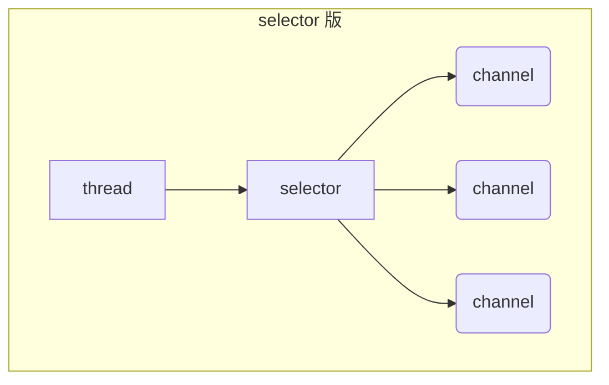

## 一、NIO基础

### BIO

Blocking IO： 同步阻塞的编程方式。

JDK1.4版本提供了BIO编程方式。编程实现过程为：首先在服务端启动一个ServerSocket来监听网络请求，客户端启动Socket发起网络请求，默认情况下ServerSocket回建立一个线程来处理此请求，如果服务端没有线程可用，客户端则会阻塞等待或遭到拒绝。通讯过程中，是同步的。在并发处理效率上比较低。


同步并阻塞，服务器实现模式为一个连接一个线程，即客户端有连接请求时服务器端就需要启动一个线程进行处理，如果这个连接不做任何事情会造成不必要的线程开销，当然可以通过线程池机制改善。BIO方式适用于连接数目比较小且固定的架构，这种方式对服务器资源要求比较高，并发局限于应用中，JDK1.4以前的唯一选择，但程序直观简单易理解。


### NIO

Unblocking IO（New IO）： 同步非阻塞的编程方式。

NIO本身是基于事件驱动思想来完成的，其主要想解决的是BIO的大并发问题，NIO基于Reactor，当socket有流可读或可写入socket时，操作系统会相应的通知引用程序进行处理，应用再将流读取到缓冲区或写入操作系统。也就是说，这个时候，已经不是一个连接就要对应一个处理线程了，而是有效的请求，对应一个线程，当连接没有数据时，是没有工作线程来处理的。


### NIO - 三大组件

**Channel & Buffer**

channel有一点类似于stream，它就是读写数据的<span style="color:red">双向通道</span>，可以从channel将数据读入buffer，也可以将buffer的数据写入channel，而之前的stream要么是输入，要么是输出，channel比stream更为底层


常见的Channel：FileChannel【File】、DatagramChannel【UDP】、SocketChannel【TCP】、ServerSocketChannel【TCP】

buffer用来缓冲读写数据，常见的buffer：MappedByteBuffer【内存映射文件】、DirectByteBuffer【直接内存分配】、HeapByteBuffer【堆内存】

**Selector**

selector的作用就是配合一个线程来管理多个channel，获取这些channel上发生的事件。这些channel工作在非阻塞模式下，适合连接数特别多，但流量低的场景。调用selector的select()会阻塞直到channel发生了读写就绪事件，当事件发生select方法就会返回这些事件交给thread来处理


### NIO - ByteBuffer

**ByteBuffer 正确使用姿势**

1. 向buffer写入数据，例如调用channel.read(buffer)
2. 调用flip()切换至<span style="color:blue">读模式</span>
3. 从 buffer 读取数据，例如调用 buffer.get()
4. 调用 clear() 或 compact() 切换至<span style="color:blue">写模式</span>
5. 重复 1~4 步骤

用buyteBuffer读取文件数据示例

```java
@Test
public void testByteBuffer() throws Exception {
  RandomAccessFile file = new RandomAccessFile("data.txt", "rw");
  FileChannel channel = file.getChannel();
  ByteBuffer buffer = ByteBuffer.allocate(10);
  int readLen = 0;
  do {
    // 向 buffer 写入
    readLen = channel.read(buffer);
    log.info("读取到字节 {}",readLen);
    // 切换 buffer 读模式
    buffer.flip();
    while (buffer.hasRemaining()) {
      log.info("{}", (char) buffer.get());
    }
    // 切换 buffer 写模式
    buffer.clear();
  } while (readLen != -1);
}
```

**ByteBuffer结构**

ByteBuffer的重要属性：capacity【容量】、position【读写位置】、limit【读写限制位置】

初始时


写模式下，position是写入位置，limit等于容量（含义是可写入的最大限制）


flip动作发生后，position切换为读取位置，limit切换为读取限制


clear动作发生后，会将position置为0，limit置为capacity位置，但是数据块不会重置


compact方法，是把未读完的部分向前压缩，然后切换至写模式


<a hre="/java/netty/ByteBufferUtil.java">调试工具类</a>

### NIO - ByteBuffer 常见方法

- 分配空间

```java
// heap 内存
ByteBuffer buf = ByteBuffer.allocate(16);
// 直接内存
ByteBuffer directBuf = ByteBuffer.allocateDirect(16);
```

- 向buffer写入数据

```java
int readBytes = channel.read(buf); //返回从channel读取的长度

buf.put((byte)127);                //手动放入数据
```

- 从buffer读取数据

```java
int writeBytes = channel.write(buf);  // 返回写入到channle的自己数量

byte b = buf.get();                   // 手动读取数据，会移动position指针
byte b = buf.get(i);                  // 手动读取数据，不移动position指针
```

- 重置读取位置

```java
buf.rewind();                         // 重置position为0

/**
 * mark & reset
 * mark在读取时，做一个标记。即使position改变，只要调用reset就能回到mark的位置
 */
@Test
public void markAndRestTest() {
  ByteBuffer buffer = ByteBuffer.allocate(10);
  buffer.put("123456".getBytes());
  buffer.flip();

  byte b1 = buffer.get(); // '1'

  buffer.mark();

  byte b2 = buffer.get(); // '2'
  byte b3 = buffer.get(); // '3'

  buffer.reset();

  byte hasB2 = buffer.get(); //'2'
  assert hasB2 == b2;
}
```

- 字符串与ByteBuffer互转

```java
// 字符串转ByteBuffer
ByteBuffer buffer1 = StandardCharsets.UTF_8.encode("你好");
debug(buffer1);

// ByteBuffer转字符串
CharBuffer buffer2 = StandardCharsets.UTF_8.decode(buffer1);
System.out.println(buffer2.toString());
```

- Scattering Reads

```java
// 分散读取，有一个文本文件 3parts.txt 内容 onetwothree
@Test
public void partsReadTest() {
  try (RandomAccessFile file = new RandomAccessFile("3parts.txt", "rw")) {
    FileChannel channel = file.getChannel();
    ByteBuffer a = ByteBuffer.allocate(3);
    ByteBuffer b = ByteBuffer.allocate(3);
    ByteBuffer c = ByteBuffer.allocate(5);
    channel.read(new ByteBuffer[]{a, b, c});
    a.flip();
    b.flip();
    c.flip();
    ByteBufferUtil.debugAll(a);	//one
    ByteBufferUtil.debugAll(b); //two
    ByteBufferUtil.debugAll(c); //three
  } catch (IOException e) {
    e.printStackTrace();
  }
}
```

- Gathering Writes

```java
// 将多个buffer的数据合并写入到一个channel
@Test
public void gatheringWritesTest() {
  try (RandomAccessFile file = new RandomAccessFile("2parts.txt", "rw")) {
    FileChannel channel = file.getChannel();
    ByteBuffer d = ByteBuffer.allocate(4);
    ByteBuffer e = ByteBuffer.allocate(4);

    d.put(new byte[]{'f', 'o', 'u', 'r'});
    e.put(new byte[]{'f', 'i', 'v', 'e'});

    d.flip();
    e.flip();

    channel.write(new ByteBuffer[]{d, e});
  } catch (IOException e) {
    e.printStackTrace();
  }
}
```

<span style="color:red">注意：Buffer是非线程安全</span>

### NIO - 文件编程

NIO中使用FileChannel建立与文件的链接通道，<span style="color:red">FileChannel只能工作在阻塞模式下</span>。

**获取**

可以通过`FileChannel.open`获取FileChannel，也可通过FileInputStream、FileOutputStream或者RandomAccessFile来获取，它们都有getChannel方法

* 通过FileInputStream获取的channel只能读
* 通过FileOutputStream获取的channel只能写
* 通过RandomAccessFile是否能读写根据构造RandomAccessFile时的读写模式决定

**读取**

```java
// 会从channel读取数据填充ByteBuffer，返回值表示读到了多少字节，-1表示到达了文件的末尾
int readBytes = channel.read(buffer);
```

**写入**

```java
// 正确的写入姿势，如果buffer较大，一次会写不完
while(buffer.hasRemaining()) {
    channel.write(buffer);
}
```

**关闭**

channel必须关闭，不过调用了FileInputStream、FileOutputStream或者RandomAccessFile的close方法会间接地调用channel的close方法

**位置**

```java
// 获取当前位置
long pos = channel.position();

/**
 * 设置当前位置
 * 设置当前位置时，如果设置为文件的末尾
 *  - 这时读取会返回 -1 
 *  - 这时写入，会追加内容，但要注意如果position超过了文件末尾，再写入时在新内容和原末尾之间会有空洞（00）
 */
channel.position(newPos);
```

**大小**

```java
channel.size(); //获取文件大小
```

**强制写入**

操作系统出于性能的考虑，会将数据缓存，不是立刻写入磁盘。可以调用`force(true) `方法将文件内容和元数据（文件的权限等信息）立刻写入磁盘

**两个 Channel 传输数据**

```java
public void fileChannelTransferToTest() {
  try (
    FileChannel from = new FileInputStream("data.txt").getChannel();
    FileChannel to = new FileOutputStream("to.txt").getChannel();
  ) {
    // 效率高，底层会利用操作系统的零拷贝进行优化
    long size = from.size();
    // left 变量代表还剩余多少字节
    for (long left = size; left > 0; ) {
      System.out.println("position:" + (size - left) + " left:" + left);
      left -= from.transferTo((size - left), left, to);
    }
  } catch (IOException e) {
    e.printStackTrace();
  }
}
```

**Path**

jdk7 引入了Path和Paths类

* Path用来表示文件路径
* Paths是工具类，用来获取Path实例

```java
Path source = Paths.get("1.txt");                     // 相对路径使用user.dir环境变量来定位1.txt

Path source = Paths.get("d:\\1.txt");                 // 绝对路径代表了d:\1.txt

Path projects = Paths.get("d:\\data", "projects");    // 代表了d:\data\projects

Path path = Paths.get("d:\\data\\projects\\a\\..\\b"); 
path.normalize()                                      // 计算为d:\data\projects\b
```

**Files**

- 检查文件是否存在

```java
Path path = Paths.get("data.txt");
System.out.println(Files.exists(path));
```

- 创建一级目录

```java
Path path = Paths.get("d1");
Files.createDirectory(path);
```

- 创建多级目录用

```java
Path path = Paths.get("d1/d2/d3");
Files.createDirectories(path);
```

- 拷贝文件

```java
Path source = Paths.get("data.txt");
Path target = Paths.get("target.txt");
// 如果文件已存在，会抛异常FileAlreadyExistsException
// 可以使用Files.copy(source, target, StandardCopyOption.REPLACE_EXISTING);
Files.copy(source, target);
```

- 移动文件

```java
Path source = Paths.get("data.txt");
Path target = Paths.get("data.txt");

// StandardCopyOption.ATOMIC_MOVE 保证文件移动的原子性
Files.move(source, target, StandardCopyOption.ATOMIC_MOVE);
```

- 删除文件

```java
Path target = Paths.get("target.txt");
Files.delete(target); // 如果文件不存在，会抛异常 NoSuchFileException
```

- 删除目录

```java
Path target = Paths.get("d1");
Files.delete(target); // 如果目录还有内容，会抛异常 DirectoryNotEmptyException
```

- 遍历目录文件

```java
@Test
public void loopDirTest() throws Exception {
  Path path = Paths.get("C:\\Program Files\\Java\\jdk1.8.0_181");
  Files.walkFileTree(path, new SimpleFileVisitor<Path>(){

    @Override
    public FileVisitResult preVisitDirectory(Path dir, BasicFileAttributes attrs) throws IOException {
      log.info("preVisitDirectory dir={}", dir.getFileName());
      return super.preVisitDirectory(dir, attrs);
    }

    @Override
    public FileVisitResult visitFile(Path file, BasicFileAttributes attrs) throws IOException {
      log.info("visitFile file={}", file.getFileName());
      return super.visitFile(file, attrs);
    }

    @Override
    public FileVisitResult visitFileFailed(Path file, IOException exc) throws IOException {
      log.info("visitFileFailed file={} exc={}", file.getFileName(), exc.getMessage());
      return super.visitFileFailed(file, exc);
    }

    @Override
    public FileVisitResult postVisitDirectory(Path dir, IOException exc) throws IOException {
      log.info("postVisitDirectory dir={}", dir.getFileName());
      return super.postVisitDirectory(dir, exc);
    }
  });
}
```

### NIO - 网络编程

#### 非阻塞vs阻塞

**阻塞**

阻塞模式下，相关方法都会导致线程暂停

* ServerSocketChannel.accept会在没有连接建立时让线程暂停
* SocketChannel.read会在没有数据可读时让线程暂停
* 阻塞的表现其实就是线程暂停了，暂停期间不会占用cpu，但线程相当于闲置

单线程下，阻塞方法之间相互影响，几乎不能正常工作，需要多线程支持

多线程下，有新的问题，体现在以下方面

* 32 位jvm一个线程320k，64位jvm一个线程1024k，如果连接数过多，必然导致OOM，并且线程太多，反而会因为频繁上下文切换导致性能降低
* 可以采用线程池技术来减少线程数和线程上下文切换，但治标不治本，如果有很多连接建立，但长时间inactive，会阻塞线程池中所有线程，因此不适合长连接，只适合短连接

```java
@Test
public void blockIOTest() throws IOException {
  // 使用 nio 来理解阻塞模式, 单线程
  // 0. ByteBuffer
  ByteBuffer buffer = ByteBuffer.allocate(16);
  // 1. 创建了服务器
  ServerSocketChannel ssc = ServerSocketChannel.open();

  // 2. 绑定监听端口
  ssc.bind(new InetSocketAddress(8080));

  // 3. 连接集合
  List<SocketChannel> channels = new ArrayList<>();
  while (true) {
    // 4. accept 建立与客户端连接， SocketChannel 用来与客户端之间通信
    log.debug("connecting...");
    SocketChannel sc = ssc.accept(); // 阻塞方法，线程停止运行
    log.debug("connected... {}", sc);
    channels.add(sc);
    for (SocketChannel channel : channels) {
      // 5. 接收客户端发送的数据
      log.debug("before read... {}", channel);
      channel.read(buffer); // 阻塞方法，线程停止运行
      buffer.flip();
      ByteBufferUtil.debugRead(buffer);
      buffer.clear();
      log.debug("after read...{}", channel);
    }
  }
}
```

**非阻塞**

* 非阻塞模式下，相关方法都会不会让线程暂停
    * 在ServerSocketChannel.accept 在没有连接建立时，会返回 null，继续运行
    * SocketChannel.read在没有数据可读时，会返回0，但线程不必阻塞，可以去执行其它SocketChannel的read或是去执行ServerSocketChannel.accept 
    * 写数据时，线程只是等待数据写入Channel即可，无需等Channel通过网络把数据发送出去
* 但非阻塞模式下，即使没有连接建立，和可读数据，线程仍然在不断运行，白白浪费了cpu
* 数据复制过程中，线程实际还是阻塞的（AIO 改进的地方）

```java
@Test
public void nonBlockIOTest() throws IOException {
  // 使用 nio 来理解非阻塞模式, 单线程
  // 0. ByteBuffer
  ByteBuffer buffer = ByteBuffer.allocate(16);
  // 1. 创建了服务器
  ServerSocketChannel ssc = ServerSocketChannel.open();
  // 非阻塞模式
  ssc.configureBlocking(false);
  // 2. 绑定监听端口
  ssc.bind(new InetSocketAddress(8080));
  // 3. 连接集合
  List<SocketChannel> channels = new ArrayList<>();
  while (true) {
    // 4. accept 建立与客户端连接， SocketChannel 用来与客户端之间通信
    SocketChannel sc = ssc.accept(); // 非阻塞，线程还会继续运行，如果没有连接建立，但sc是null
    if (sc != null) {
      log.debug("connected... {}", sc);
      sc.configureBlocking(false); // 非阻塞模式
      channels.add(sc);
    }
    for (SocketChannel channel : channels) {
      // 5. 接收客户端发送的数据
      int read = channel.read(buffer);// 非阻塞，线程仍然会继续运行，如果没有读到数据，read 返回 0
      if (read > 0) {
        buffer.flip();
        ByteBufferUtil.debugRead(buffer);
        buffer.clear();
        log.debug("after read...{}", channel);
      }
    }
  }
}
```

#### Selector

单线程可以配合Selector完成对多个Channel可读写事件的监控，<span style="color:blue">这称之为多路复用</span>

* 多路复用仅针对网络IO、普通文件IO没法利用多路复用
* 如果不用Selector的非阻塞模式，线程大部分时间都在做无用功，而Selector能够保证
    * 有可连接事件时才去连接
    * 有可读事件才去读取
    * 有可写事件才去写入【限于网络传输能力，Channel未必时时可写，一旦Channel可写，会触发Selector的可写事件】



- 创建

```java
Selector selector = Selector.open();
```

- 绑定 Channel 事件

```java
/**
 * channel 必须工作在非阻塞模式
 * 绑定的事件类型可以有
 *  - connect - 客户端连接成功时触发
 *  - accept  - 服务器端成功接受连接时触发
 *  - read    - 数据可读入时触发，有因为接收能力弱，数据暂不能读入的情况
 *  - write   - 数据可写出时触发，有因为发送能力弱，数据暂不能写出的情况
 */
channel.configureBlocking(false);
SelectionKey key = channel.register(selector, SelectionKey.OP_ACCEPT);
```

- 监听 Channel 事件

```java
// 阻塞直到绑定事件发生
int count = selector.select();

// 阻塞直到绑定事件发生，或是超时（时间单位为 ms）
int count = selector.select(1000L);

// 不会阻塞，也就是不管有没有事件，立刻返回，自己根据返回值检查是否有事件
int count = selector.selectNow();
```

> select不阻塞的情况：①事件发生时；②调用selector.wakeup()；③调用selector.close()；④selector所在线程interrupt

- 处理 accept 事件

```java
@Test
public void acceptorTest() {
  try (ServerSocketChannel channel = ServerSocketChannel.open()) {
    channel.bind(new InetSocketAddress(8080));
    System.out.println(channel);
    Selector selector = Selector.open();
    channel.configureBlocking(false);
    channel.register(selector, SelectionKey.OP_ACCEPT);
    while (true) {
      int count = selector.select();
      log.debug("select count: {}", count);
      // 获取所有事件
      Set<SelectionKey> keys = selector.selectedKeys();
      // 遍历所有事件，逐一处理
      Iterator<SelectionKey> iter = keys.iterator();
      while (iter.hasNext()) {
        SelectionKey key = iter.next();
        // 判断事件类型
        if (key.isAcceptable()) {
          ServerSocketChannel c = (ServerSocketChannel) key.channel();
          // 必须处理
          SocketChannel sc = c.accept();
          log.debug("{}", sc);
        }
        // 处理完毕，必须将事件移除
        iter.remove();
      }
    }
  } catch (IOException e) {
    e.printStackTrace();
  }
}
```

- 处理 read 事件

```java
@Test
public void readEventTest() {
  try (ServerSocketChannel channel = ServerSocketChannel.open()) {
    channel.bind(new InetSocketAddress(8080));
    System.out.println(channel);
    Selector selector = Selector.open();
    channel.configureBlocking(false);
    channel.register(selector, SelectionKey.OP_ACCEPT);

    while (true) {
      int count = selector.select();
      log.debug("select count: {}", count);
      // 获取所有事件
      Set<SelectionKey> keys = selector.selectedKeys();

      // 遍历所有事件，逐一处理
      Iterator<SelectionKey> iter = keys.iterator();
      while (iter.hasNext()) {
        SelectionKey key = iter.next();
        // 判断事件类型
        if (key.isAcceptable()) {
          ServerSocketChannel c = (ServerSocketChannel) key.channel();
          // 必须处理
          SocketChannel sc = c.accept();
          sc.configureBlocking(false);
          sc.register(selector, SelectionKey.OP_READ);
          log.debug("连接已建立: {}", sc);
        } else if (key.isReadable()) {
          SocketChannel sc = (SocketChannel) key.channel();
          ByteBuffer buffer = ByteBuffer.allocate(128);
          int read = sc.read(buffer);
          if (read == -1) {
            // cancel会取消注册在selector上的channel，并从keys集合中删除key后续不会再监听事件
            key.cancel();
            sc.close();
          } else {
            buffer.flip();
            ByteBufferUtil.debugRead(buffer);
          }
        }
        // 处理完毕，必须将事件移除
        iter.remove();
      }
    }
  } catch (IOException e) {
    e.printStackTrace();
  }
}
```

- <span id="bound">处理消息的边界</span>

    

①一种思路是固定消息长度，数据包大小一样，服务器按预定长度读取，缺点是浪费带宽

②另一种思路是按分隔符拆分，缺点是效率低

③TLV格式，即Type类型、Length长度、Value数据，类型和长度已知的情况下，就可以方便获取消息大小，分配合适的buffer，缺点是buffer需要提前分配，如果内容过大，则影响server吞吐量，Http1.1是TLV格式、Http2.0是LTV格式

```java
private static void split(ByteBuffer source) {
  source.flip();
  for (int i = 0; i < source.limit(); i++) {
    // 找到一条完整消息
    if (source.get(i) == '\n') {
      int length = i + 1 - source.position();
      // 把这条完整消息存入新的 ByteBuffer
      ByteBuffer target = ByteBuffer.allocate(length);
      // 从 source 读，向 target 写
      for (int j = 0; j < length; j++) {
        target.put(source.get());
      }
      ByteBufferUtil.debugAll(target);
    }
  }
  source.compact();
}


// 使用 \n 区分消息段
if (key.isReadable()) {
  try {
    SocketChannel channel = (SocketChannel) key.channel(); // 拿到触发事件的channel
    // 获取selectionKey上关联的附件，在accept时设置上的
    ByteBuffer buffer = (ByteBuffer) key.attachment();
    int read = channel.read(buffer); // 如果是正常断开，read的方法的返回值是-1
    if(read == -1) {
      key.cancel();
    } else {
      split(buffer);
      // 需要扩容
      if (buffer.position() == buffer.limit()) {
        ByteBuffer newBuffer = ByteBuffer.allocate(buffer.capacity() * 2);
        buffer.flip();
        newBuffer.put(buffer);
        key.attach(newBuffer);
      }
    }
  } catch (IOException e) {
    e.printStackTrace();
    key.cancel();  // 因为客户端断开了,因此需要将 key 取消
  }
}
```

- ByteBuffer 大小分配

每个channel都需要记录可能被切分的消息，因为ByteBuffer不能被多个channel共同使用，因此需要为每个channel维护一个独立的ByteBuffer，ByteBuffer不能太大，比如一个ByteBuffer1Mb的话，要支持百万连接就要1Tb内存，因此需要设计大小可变的ByteBuffer

①一种思路是首先分配一个较小的buffer，例如4k如果发现数据不够，再分配8k的。将4k buffer内容拷贝至8k的，优点是消息连续容易处理，缺点是数据拷贝耗费性能

②另一种思路是用多个数组组成buffer，一个数组不够，把多出来的内容写入新的数组，与前面的区别是消息存储不连续解析复杂，优点是避免了拷贝引起的性能损耗

- 处理 write 事件

非阻塞模式下，无法保证把buffer中所有数据都写入channel【网卡能力也是有限的】，因此需要追踪write方法的返回值（代表实际写入字节数）

用selector监听所有channel的可写事件，每个channe 都需要一个key来跟踪buffer，但这样又会导致占用内存过多，就有两阶段策略

①当消息处理器第一次写入消息时，才将channel注册到selector上

②selector 检查channel上的可写事件，如果所有的数据写完了，就取消channel的注册

```java
if (key.isAcceptable()) {
  SocketChannel sc = ssc.accept();
  sc.configureBlocking(false);
  SelectionKey sckey = sc.register(selector, SelectionKey.OP_READ);
  // 1. 向客户端发送内容
  StringBuilder sb = new StringBuilder();
  for (int i = 0; i < 3000000; i++) {
    sb.append("a");
  }
  ByteBuffer buffer = Charset.defaultCharset().encode(sb.toString());
  int write = sc.write(buffer);
  // 3. write 表示实际写了多少字节
  System.out.println("实际写入字节:" + write);
  // 4. 如果有剩余未读字节，才需要关注写事件
  if (buffer.hasRemaining()) {
    // read 1  write 4
    // 在原有关注事件的基础上，多关注 写事件
    sckey.interestOps(sckey.interestOps() + SelectionKey.OP_WRITE);
    // 把 buffer 作为附件加入 sckey
    sckey.attach(buffer);
  }
} else if (key.isWritable()) {
  ByteBuffer buffer = (ByteBuffer) key.attachment();
  SocketChannel sc = (SocketChannel) key.channel();
  int write = sc.write(buffer);
  System.out.println("实际写入字节:" + write);
  if (!buffer.hasRemaining()) { // 写完了
    key.interestOps(key.interestOps() - SelectionKey.OP_WRITE); // 如果不取消，会每次可写均会触发write事件
    key.attach(null);
  }
}
```

> 事件发生后，要么处理，要么取消（cancel），不能什么都不做，否则下次该事件仍会触发，这是因为nio底层使用的是水平触发
>
> select在事件发生后，就会将相关的key放入selectedKeys集合，但不会在处理完后从selectedKeys集合中移除，需要我们自己编码删除。例如
>
> * 第一次触发了ssckey上的accept事件，没有移除ssckey 
> * 第二次触发了sckey上的read事件，但这时selectedKeys中还有上次的ssckey，在处理时因为没有真正的serverSocket连上了，就会导致空指针异常

#### 零拷贝

**传统IO 传输数据问题**


1. java本身并不具备IO读写能力，因此read方法调用后，要从java程序的`用户态`切换至`内核态`，去调用操作系统（Kernel）的读能力，将数据读入`内核缓冲区`。这期间用户线程阻塞，操作系统使用DMA（Direct Memory Access）来实现文件读，其间也不会使用cpu

    > DMA可以理解为硬件单元，用来解放cpu完成文件IO

2. 从`内核态`切换回`用户态`，将数据从`内核缓冲区`读入`用户缓冲区`（即 byte[] buf），这期间cpu会参与拷贝，无法利用DMA

3. 调用write方法，这时将数据从`用户缓冲区`（byte[] buf）写入`socket 缓冲区`，cpu会参与拷贝

4. 接下来要向网卡写数据，这项能力java又不具备，因此又得从`用户态`切换至`内核态`，调用操作系统的写能力，使用DMA将`socket 缓冲区`的数据写入网卡，不会使用cpu

> 可以看到中间环节较多，java 的 IO 实际不是物理设备级别的读写，而是缓存的复制，底层的真正读写是操作系统来完成的
>
> * 用户态与内核态的切换发生了 3 次，这个操作比较重量级
> * 数据拷贝了共 4 次

**NIO 优化**

通过`ByteBuffer.allocateDirect(capacity)` 创建DirectByteBuffer使用的是操作系统内存。DirectByteBuf将堆外内存映射到jvm内存中来直接访问使用，


* 这块内存不受 jvm 垃圾回收的影响，因此内存地址固定，有助于 IO 读写
* java 中的 DirectByteBuf 对象仅维护了此内存的虚引用，内存回收分成两步
    * DirectByteBuf 对象被垃圾回收，将虚引用加入引用队列
    * 通过专门线程访问引用队列，根据虚引用释放堆外内存
* 减少了一次数据拷贝，用户态与内核态的切换次数没有减少

---

进一步优化（底层采用了linux 2.1后提供的sendFile方法），java 中对应着两channel调用transferTo/transferFrom方法拷贝数据


1. java调用transferTo方法后，要从java程序的`用户态`切换至`内核态`，使用 DMA将数据读入`内核缓冲区`，不会使用 cpu
2. 数据从`内核缓冲区`传输到`socket 缓冲区`，cpu会参与拷贝
3. 最后使用DMA将`socket 缓冲区`的数据写入网卡，不会使用 cpu

> 只发生了一次用户态与内核态的切换，数据拷贝了 3 次

---

进一步优化（linux 2.4）


1. java调用transferTo方法后，要从java程序的`用户态`切换至`内核态`，使用DMA将数据读入`内核缓冲区`，不会使用 cpu
2. 只会将一些offset和length信息拷入`socket 缓冲区`，几乎无消耗
3. 使用DMA将`内核缓冲区`的数据写入网卡，不会使用 cpu

> 整个过程仅只发生了一次用户态与内核态的切换，数据拷贝了 2 次。
>
> 所谓的【零拷贝】，并不是真正无拷贝，而是在不会拷贝重复数据到 jvm 内存中

### NIO vs BIO

**stream vs channel**

* stream不会自动缓冲数据，channel会利用系统提供的发送缓冲区、接收缓冲区（更为底层）
* stream仅支持阻塞API，channel同时支持阻塞、非阻塞API，网络channel可配合selector实现多路复用
* 二者均为全双工，即读写可以同时进行

**IO 模型**

同步阻塞、同步非阻塞、同步多路复用、异步阻塞（没有此情况）、异步非阻塞

* 同步：线程自己去获取结果（一个线程）
* 异步：线程自己不去获取结果，而是由其它线程送结果（至少两个线程）

## 二、Netty的基本使用

### 简介

Netty是一个异步的、基于事件驱动的网络应用框架，用于快速开发可维护、高性能的网络服务器和客户端。

Netty vs NIO的优势

1. NIO，工作量大，bug 多
2. NIO需要自己构建协议
3. Netty解决TCP传输问题，如粘包、半包
4. NIO的epoll空轮询导致CPU100%
5. 对API进行增强，使之更易用

### 最基础的Netty示例

- 服务器端

```java
@Test
public void simpleServerTest() throws IOException {
  new ServerBootstrap()
    // 创建 NioEventLoopGroup，可以简单理解为 线程池 + Selector
    .group(new NioEventLoopGroup())
    // 选择服务Socket实现类，其中NioServerSocketChannel表示基于NIO的服务器端实现
    .channel(NioServerSocketChannel.class)
    //  childHandler添加的处理器都是给SocketChannel用的，而不是给ServerSocketChannel
    //  ChannelInitializer处理器（仅执行一次），它的作用是待客户端SocketChannel建立连接后，执行initChannel以便添加更多的处理器
    .childHandler(new ChannelInitializer<NioSocketChannel>() {

      protected void initChannel(NioSocketChannel ch) {
        // SocketChannel 的处理器，解码 ByteBuf => String
        ch.pipeline().addLast(new StringDecoder());
        
        // SocketChannel 的业务处理器，使用上一个处理器的处理结果
        ch.pipeline().addLast(new SimpleChannelInboundHandler<String>() {

          @Override
          protected void channelRead0(ChannelHandlerContext ctx, String msg) {
            System.out.println(msg);
          }
        });
      }
    })
    // 绑定的监听端口
    .bind(8080);
  System.in.read();
}
```

- 客户端

```java
@Test
public void simpleClientTest() throws IOException, InterruptedException {
  ChannelFuture client = new Bootstrap()
    // 创建 NioEventLoopGroup，可以简单理解为 线程池 + Selector
    .group(new NioEventLoopGroup())
    // 选择服务Socket实现类，其中NioSocketChannel表示基于NIO的客户器端实现
    .channel(NioSocketChannel.class)
    //  ChannelInitializer处理器（仅执行一次），它的作用是待客户端SocketChannel建立连接后，执行initChannel以便添加更多的处理器
    .handler(new ChannelInitializer<NioSocketChannel>() {

      protected void initChannel(NioSocketChannel ch) {
        // SocketChannel 的处理器，编码 ByteBuf => String
        ch.pipeline().addLast(new StringEncoder());
      }
      // 连接服务器
    }).connect(new InetSocketAddress(8080));
  // Future是异步的，要等待连接上服务器
  client.sync();
  // 发送数据
  client.channel().writeAndFlush("Hello world");
  System.in.read();
}
```

### 相关概念

需要树立正确的理解观念

1. 把 channel 理解为数据的通道
2. 把 msg 理解为流动的数据，最开始输入是 ByteBuf，但经过 pipeline 的加工，会变成其它类型对象，最后输出又变成 ByteBuf
3. 把 handler 理解为数据的处理工序
    - 工序有多道，合在一起就是pipeline，pipeline负责发布事件（读、读取完成...）传播给每个handler， handler对自己感兴趣的事件进行处理（重写了相应事件处理方法）
    - handler分Inbound和Outbound两类
4. 把 eventLoop 理解为处理数据的工人
    * 工人可以管理多个channel的io操作，并且一旦工人负责了某个 channel，就要负责到底（绑定）
    * 工人既可以执行io操作，也可以进行任务处理，每位工人有任务队列，队列里可以堆放多个channel的待处理任务，任务分为普通任务、定时任务
    * 工人按照pipeline顺序，依次按照handler的规划（代码）处理数据，可以为每道工序指定不同的工人

### EventLoop组件

**EventLoop【时间循环对象】**

本质是一个单线程执行器（同时维护了一个Selector），里面有run方法处理Channel上源源不断的io事件


**EventLoopGroup【事件循环组】**

EventLoopGroup是一组EventLoop，Channel一般会调用EventLoopGroup的register方法来绑定其中一个EventLoop，后续这个Channel上的io事件都由此 EventLoop来处理（保证了io事件处理时的线程安全），有next方法获取集合中下一个EventLoop

```java
// 简单的示例
DefaultEventLoopGroup group = new DefaultEventLoopGroup(2);
System.out.println(group.next());  //io.netty.channel.DefaultEventLoop@60f82f98
System.out.println(group.next());  //io.netty.channel.DefaultEventLoop@35f983a6
System.out.println(group.next());  //io.netty.channel.DefaultEventLoop@60f82f98

// 也可以是有for循环
DefaultEventLoopGroup group = new DefaultEventLoopGroup(2);
for (EventExecutor eventLoop : group) {
    System.out.println(eventLoop);
}
```

**优雅关闭**

优雅关闭 `shutdownGracefully` 方法。该方法会首先切换 `EventLoopGroup` 到关闭状态从而拒绝新的任务的加入，然后在任务队列的任务都处理完成后，停止线程的运行。从而确保整体应用是在正常有序的状态下退出。

```java
@Test
public void simpleClientTest() throws IOException, InterruptedException {
  NioEventLoopGroup eventLoopGroup = new NioEventLoopGroup();
  ChannelFuture client = new Bootstrap()
    .group(eventLoopGroup)
    .channel(NioSocketChannel.class)
    .handler(new ChannelInitializer<NioSocketChannel>() {
      protected void initChannel(NioSocketChannel ch) {
        ch.pipeline().addLast(new StringEncoder());
      }
    }).connect(new InetSocketAddress(8080));
  client.sync();
  client.channel().writeAndFlush("Hello world");
  // 优雅关闭
  eventLoopGroup.shutdownGracefully().sync();
}
```

**eventLoop和channel强绑定**

关键代码 `io.netty.channel.AbstractChannelHandlerContext#invokeChannelRead()`

```java
static void invokeChannelRead(final AbstractChannelHandlerContext next, Object msg) {
  final Object m = next.pipeline.touch(ObjectUtil.checkNotNull(msg, "msg"), next);
  // 下一个 handler 的事件循环是否与当前的事件循环是同一个线程
  EventExecutor executor = next.executor();

  // 是，直接调用
  if (executor.inEventLoop()) {
    next.invokeChannelRead(m);
  } 
  // 不是，将要执行的代码作为任务提交给下一个事件循环处理（换人）
  else {
    executor.execute(new Runnable() {
      @Override
      public void run() {
        next.invokeChannelRead(m);
      }
    });
  }
}
```

### Channel组件

**channel的主要作用**

1. close() 可以用来关闭channel
2. closeFuture() 用来处理channel的关闭
    - sync方法作用是同步等待channel关闭
    - 而addListener方法是异步等待channel关闭
3. pipeline() 方法添加处理器
4. write() 方法将数据写入
5. writeAndFlush() 方法将数据写入并刷出

**ChannelFuture**

```java
public void simpleClientTest() throws IOException, InterruptedException {
  NioEventLoopGroup eventLoopGroup = new NioEventLoopGroup();
  ChannelFuture client = new Bootstrap()
    .group(eventLoopGroup)
    .channel(NioSocketChannel.class)
    .handler(new ChannelInitializer<NioSocketChannel>() {

      protected void initChannel(NioSocketChannel ch) {
        ch.pipeline().addLast(new StringEncoder());
      }
    }).connect(new InetSocketAddress(8080));
  // connect方法是异步的，意味着不等连接建立，方法执行就返回了。
  // 因此channelFuture对象中不能【立刻】获得到正确的Channel对象
  client.sync();
  // 返回的是ChannelFuture对象，它的作用是利用channel()方法来获取Channel对象
  client.channel().writeAndFlush("Hello world");
  ChannelFuture channelFuture = client.channel().closeFuture();
  // 可执行channel关闭后的扫尾操作
  channelFuture.addListener(new GenericFutureListener<Future<? super Void>>() {

    @Override
    public void operationComplete(Future<? super Void> future) throws Exception {
      System.out.println("关闭后扫尾操作");
    }
  });
  eventLoopGroup.shutdownGracefully().sync();
}
```

**异步的好处**

举个例子，如果4个医生同步处理看病的全流程，则会是如下，假设挂号、取药10min，看病、缴费20min，则60min能走完4个病人看病流程


如果改为异步，则60min，可以处理6个挂号，6个取药，3个看病，3个缴费。这样挂号数量上升会使吞吐量上升。单实际看完的病人数量会下降。


* 单线程没法异步提高效率，必须配合多线程、多核 cpu 才能发挥异步的优势
* 异步并没有缩短响应时间，反而有所增加，提高的是吞吐量
* 合理进行任务拆分，也是利用异步的关键

### Future & Promise

在异步处理时，经常用到这两个接口

首先要说明netty中的Future与jdk中的Future同名，但是是两个接口，netty的Future继承自jdk的Future，而Promise又对netty Future进行了扩展

* jdk Future只能同步等待任务结束（或成功、或失败）才能得到结果
* netty Future可以同步等待任务结束得到结果，也可以异步方式得到结果，但都是要等任务结束
* netty Promise不仅有netty Future的功能，而且脱离了任务独立存在，只作为两个线程间传递结果的容器

| 功能/名称    | jdk Future                     | netty Future                                                 | Promise      |
| ------------ | ------------------------------ | ------------------------------------------------------------ | ------------ |
| cancel       | 取消任务                       | -                                                            | -            |
| isCanceled   | 任务是否取消                   | -                                                            | -            |
| isDone       | 任务是否完成，不能区分成功失败 | -                                                            | -            |
| get          | 获取任务结果，阻塞等待         | -                                                            | -            |
| getNow       | -                              | 获取任务结果，非阻塞，还未产生结果时返回 null                | -            |
| await        | -                              | 等待任务结束，如果任务失败，不会抛异常，而是通过isSuccess判断 | -            |
| sync         | -                              | 等待任务结束，如果任务失败，抛出异常                         | -            |
| isSuccess    | -                              | 判断任务是否成功                                             | -            |
| cause        | -                              | 获取失败信息，非阻塞，如果没有失败，返回null                 | -            |
| addLinstener | -                              | 添加回调，异步接收结果                                       | -            |
| setSuccess   | -                              | -                                                            | 设置成功结果 |
| setFailure   | -                              | -                                                            | 设置失败结果 |

示例

```java
// ==================================== 同步处理任务成功 ====================================
public void syncSuccessTest() throws ExecutionException, InterruptedException {
  DefaultEventLoop eventExecutors = new DefaultEventLoop();
  DefaultPromise<Integer> promise = new DefaultPromise<>(eventExecutors);

  eventExecutors.execute(()->{
    try {
      Thread.sleep(1000);
    } catch (InterruptedException e) {
      e.printStackTrace();
    }
    log.info("set success, {}",10);
    promise.setSuccess(10);
  });

  log.info("start...");
  log.info("getNow = {}",promise.getNow()); // 还没有结果
  log.info("get = {}",promise.get());
}

// ==================================== 异步处理任务成功 ====================================
public void asyncSuccessTest() throws ExecutionException, InterruptedException {
  DefaultEventLoop eventExecutors = new DefaultEventLoop();
  DefaultPromise<Integer> promise = new DefaultPromise<>(eventExecutors);

  // 设置回调，异步接收结果
  promise.addListener(future -> {
    log.info("getNow = {}", future.getNow());
  });

  // 等待 1000 后设置成功结果
  eventExecutors.execute(() -> {
    try {
      Thread.sleep(1000);
    } catch (InterruptedException e) {
      e.printStackTrace();
    }
    log.info("set success, {}", 10);
    promise.setSuccess(10);
  });

  log.info("start...");
  promise.await();
}
```

### Handler & Pipeline

ChannelHandler用来处理Channel上的各种事件，分为入站、出站两种。所有ChannelHandler被连成一串，就是Pipeline

* 入站处理器通常是ChannelInboundHandlerAdapter的子类，主要用来读取客户端数据，写回结果
* 出站处理器通常是ChannelOutboundHandlerAdapter的子类，主要对写回结果进行加工

ChannelInboundHandlerAdapter是按照addLast的顺序执行的，而ChannelOutboundHandlerAdapter是按照addLast的逆序执行的。ChannelPipeline的实现是一个ChannelHandlerContext（包装了 ChannelHandler）组成的双向链表


读取消息执行顺序：Head -> In_1 -> In_2 -> Out_1（不处理）-> Out_2（不处理）-> Tail

发送消息执行顺序：Tail ->  Out_2 -> Out_1 -> In_2 （不处理）-> In_1 （不处理）-> Head 

> chx.writeAndFlush是从当前位置向Head返回发送数据
>
> ch.writeAndFlush是从Tail向Head返回发送数据，如果是在ChannelOutboundHandlerAdapte进行会是死循环

### ByteBuf

是对字节数据的封装，提供了比NIO ByteBuffer更好的使用体验

调试准备

```java
private static void log(ByteBuf buffer) {
  int length = buffer.readableBytes();
  int rows = length / 16 + (length % 15 == 0 ? 0 : 1) + 4;
  StringBuilder buf = new StringBuilder(rows * 80 * 2)
    .append("read index:").append(buffer.readerIndex())
    .append(" write index:").append(buffer.writerIndex())
    .append(" capacity:").append(buffer.capacity())
    .append(" class:").append(buffer.getClass())
    .append(NEWLINE);
  ByteBufUtil.appendPrettyHexDump(buf, buffer);
  System.out.println(buf.toString());
}
```

**1）创建**

```java
@Test
public void byteBufTest() {
  // 默认创建的是池化的直接内存
  ByteBuf buffer = ByteBufAllocator.DEFAULT.buffer(10);
  // read index:0 write index:0 capacity:10 class:class io.netty.buffer.PooledUnsafeDirectByteBuf
  log(buffer);
}
```

**2）直接内存 vs 堆内存**

可以使用下面的代码来创建池化基于堆的 ByteBuf

```java
ByteBuf buffer = ByteBufAllocator.DEFAULT.heapBuffer(10);
```

也可以使用下面的代码来创建池化基于直接内存的 ByteBuf

```java
ByteBuf buffer = ByteBufAllocator.DEFAULT.directBuffer(10);
```

* 直接内存创建和销毁的代价昂贵，但读写性能高（少一次内存复制），适合配合池化功能一起用
* 直接内存对 GC 压力小，因为这部分内存不受 JVM 垃圾回收的管理，但也要注意及时主动释放

**3）池化 vs 非池化**

池化的最大意义在于可以重用 ByteBuf，优点有

* 没有池化，则每次都得创建新的 ByteBuf 实例，这个操作对直接内存代价昂贵，就算是堆内存，也会增加 GC 压力
* 有了池化，则可以重用池中 ByteBuf 实例，并且采用了与 jemalloc 类似的内存分配算法提升分配效率
* 高并发时，池化功能更节约内存，减少内存溢出的可能

池化功能是否开启，可以通过系统环境变量来设置`-Dio.netty.allocator.type={unpooled|pooled}`

* 4.1 以后，非 Android 平台默认启用池化实现，Android 平台启用非池化实现
* 4.1 之前，池化功能还不成熟，默认是非池化实现

**4）组成**


**5）写入**

| 方法签名                                                     | 含义                   | 备注                                        |
| ------------------------------------------------------------ | ---------------------- | ------------------------------------------- |
| writeBoolean(boolean value)                                  | 写入 boolean 值        | 用一字节 01\|00 代表 true\|false            |
| writeByte(int value)                                         | 写入 byte 值           |                                             |
| writeShort(int value)                                        | 写入 short 值          |                                             |
| writeInt(int value)                                          | 写入 int 值            | Big Endian，即 0x250，写入后 00 00 02 50    |
| writeIntLE(int value)                                        | 写入 int 值            | Little Endian，即 0x250，写入后 50 02 00 00 |
| writeLong(long value)                                        | 写入 long 值           |                                             |
| writeChar(int value)                                         | 写入 char 值           |                                             |
| writeFloat(float value)                                      | 写入 float 值          |                                             |
| writeDouble(double value)                                    | 写入 double 值         |                                             |
| writeBytes(ByteBuf src)                                      | 写入 netty 的 ByteBuf  |                                             |
| writeBytes(byte[] src)                                       | 写入 byte[]            |                                             |
| writeBytes(ByteBuffer src)                                   | 写入 nio 的 ByteBuffer |                                             |
| int writeCharSequence(CharSequence sequence, Charset charset) | 写入字符串             |                                             |

**6）扩容**

ByteBuf具有自动扩容能力，规则是

* 如何写入后数据大小未超过 512，则选择下一个16的整数倍，例如写入后大小为12 ，则扩容后capacity是16
* 如果写入后数据大小超过512，则选择下一个 2^n，例如写入后大小为513，则扩容后 capacity是2^10=1024（2^9=512 已经不够了）
* 扩容不能超过max capacity否则报错

**7）读取**

```java
@Test
public void byteBufReadTest() {
  ByteBuf buffer = ByteBufAllocator.DEFAULT.buffer(10);
  buffer.writeBytes("ABCDEFG".getBytes());

  // 读取，影响读指针
  System.out.println((char)buffer.readByte()); // A
  System.out.println((char)buffer.readByte()); // B
  System.out.println((char)buffer.readByte()); // C
  System.out.println((char)buffer.readByte()); // D

  // mark标记读指针
  buffer.markReaderIndex();
  System.out.println((char)buffer.readByte()); // E
  System.out.println((char)buffer.readByte()); // F
  // 读指针复位
  buffer.resetReaderIndex();
  System.out.println((char)buffer.readByte()); // E

  // get方法不影响指针
  System.out.println((char)buffer.getByte(0)); // A
}
```

**8）retain & release**

由于Netty中有堆外内存的ByteBuf实现，堆外内存最好是手动来释放，而不是等GC垃圾回收

* UnpooledHeapByteBuf 使用的是 JVM 内存，只需等 GC 回收内存即可
* UnpooledDirectByteBuf 使用的就是直接内存了，需要特殊的方法来回收内存
* PooledByteBuf 和它的子类使用了池化机制，需要更复杂的规则来回收内存

Netty 这里采用了引用计数法来控制回收内存，每个 ByteBuf 都实现了 ReferenceCounted 接口

* 每个ByteBuf对象的初始计数为 1
* 调用release方法计数减 1，如果计数为0，ByteBuf内存被回收
* 调用retain方法计数加 1，表示调用者没用完之前，其它handler即使调用了release也不会造成回收
* 当计数为0时，底层内存会被回收，这时即使ByteBuf对象还在，其各个方法均无法正常使用

因为pipeline的存在，一般需要将ByteBuf传递给下一个ChannelHandler，所以基本规则是，**谁是最后使用者，谁负责 release**，即TailContext负责释放

**9）slice**

【零拷贝】的体现之一，对原始ByteBuf进行切片成多个ByteBuf，还是使用原始ByteBuf的内存，切片后的ByteBuf维护独立的read，write指针


**10）duplicate**

【零拷贝】的体现之一，截取了原始ByteBuf所有内容，并且没有max capacity的限制，也是与原始ByteBuf使用同一块底层内存，只是读写指针是独立的


**11）copy**

会将底层内存数据进行深拷贝，因此无论读写，都与原始 ByteBuf 无关

**12）CompositeByteBuf**

【零拷贝】的体现之一，将多个ByteBuf合并为一个逻辑上的ByteBuf，避免拷贝。CompositeByteBuf是一个组合的ByteBuf，它内部维护了一个Component数组，每个Component管理一个ByteBuf，记录了这个ByteBuf 相对于整体偏移量等信息，代表着整体中某一段的数据。


**13）Unpooled**

Unpooled 是一个工具类，类如其名，提供了非池化的 ByteBuf 创建、组合、复制等操作

```java
@Test
public void byteBufUnpooledTest() {
  ByteBuf buffer1 = Unpooled.buffer(10);
  buffer1.release();
  ByteBuf buffer2 = Unpooled.buffer(10);
  buffer2.release();

  // false
  System.out.println(buffer1 == buffer2);

  ByteBuf buffer3 = ByteBufAllocator.DEFAULT.buffer(10);
  buffer3.release();
  ByteBuf buffer4 = ByteBufAllocator.DEFAULT.buffer(10);
  buffer4.release();

  // true
  System.out.println(buffer3 == buffer4);
}
```

**ByteBuf 优势**

* 池化 - 可以重用池中 ByteBuf 实例，更节约内存，减少内存溢出的可能
* 读写指针分离，不需要像 ByteBuffer 一样切换读写模式
* 可以自动扩容
* 支持链式调用，使用更流畅
* 很多地方体现零拷贝，例如 slice、duplicate、CompositeByteBuf

## 三、Netty高级用法

### 粘包与半包

粘包和半包的现象是<a href="#bound">消息边界</a>的另一种说法

粘包

* 现象：发送 abc def，接收 abcdef
* 原因
    * 应用层：接收方ByteBuf设置太大（Netty默认1024）
    * 滑动窗口：假设发送方256bytes表示一个完整报文，但由于接收方处理不及时且窗口大小足够大，这256bytes 字节就会缓冲在接收方的滑动窗口中，当滑动窗口中缓冲了多个报文就会粘包
    * Nagle算法：会造成粘包

半包

* 现象：发送 abcdef，接收 abc def
* 原因
    * 应用层：接收方ByteBuf小于实际发送数据量
    * 滑动窗口：假设接收方的窗口只剩了128bytes，发送方的报文大小是256bytes，这时放不下了，只能先发送前128bytes，等待ack后才能发送剩余部分，这就造成了半包
    * MSS限制：当发送的数据超过MSS限制后，会将数据切分发送，就会造成半包

> Nagle 算法
>
> 即使发送一个字节，也需要加入tcp头和ip头，也就是总字节数会使用41bytes，非常不经济。因此为了提高网络利用率，tcp希望尽可能发送足够大的数据，这就是 Nagle 算法产生的缘由，该算法是指发送端即使还有应该发送的数据，但如果这部分数据很少的话，则进行延迟发送

> MSS限制
>
> MSS的值在三次握手时通知对方自己MSS的值【网卡的传输能力】，然后在两者之间选择一个小值作为MSS

**Netty解决的途径**

固定长度

让所有数据包长度固定

```java
ch.pipeline().addLast(new FixedLengthFrameDecoder(8));
```

缺点：

1. 长度定的太大，浪费
2. 长度定的太小，对某些数据包又显得不够

---

固定分隔符

服务端加入，默认以`\n`或`\r\n`作为分隔符，如果超出指定长度仍未出现分隔符，则抛出异常

```java
ch.pipeline().addLast(new LineBasedFrameDecoder(1024));
```

缺点：处理字符数据比较合适，但如果内容本身包含了分隔符（字节数据常常会有此情况），那么就会解析错误

---

预设长度

```java
// 最大长度，长度偏移，长度占用字节，长度调整，剥离字节数
ch.pipeline().addLast(new LengthFieldBasedFrameDecoder(1024, 0, 1, 0, 1));
```

### 心跳机制

可以使用`IdleStateHandler`发送心跳，也可以自定义发送心跳

```java
/**
  * readerIdleTime 读空闲时间
  * writerIdleTime 写空闲时间
  * allIdleTime 所有空闲时间
  * unit 时间单位
  */
pipeline.addLast(new IdleStateHandler(0, 5, 0, TimeUnit.SECONDS));
```

### 编码

Netty编解码技术（就是指序列化传递对象），我们可以使用Java进行对象序列化，netty去传输，但是Java序列化没法跨语言，存在序列化后的码流太大，序列化性能太低等。

主流的编解码框架 

- JBoss的Marshalling
- google的ProtoBuf
- 基于Protobuf的Kyro
- MessagePack框架

```java
//======================================= 集成Marshalling =======================================
public class MarshallingCodeFactory {

  public static MarshallingDecoder bulidMarshallingDecoder(){
    //首先通过Marshalling工具类获取Marshalling实例对象，参数serial标识创建的是java序列化工厂对象
    MarshallerFactory marshallerFactory = Marshalling.getProvidedMarshallerFactory("serial");
    //创建了MarshallingConfiguration对象，配置版本号为5
    MarshallingConfiguration configuration = new MarshallingConfiguration();
    configuration.setVersion(5);
    //根据marshallerFactory好Configuration创建provider
    UnmarshallerProvider provider = new DefaultUnmarshallerProvider(marshallerFactory, configuration);
    //构建Netty的MarshallingDecoder对象，俩个参数分别为provider和单个消息序列化后的最大长度
    MarshallingDecoder decoder = new MarshallingDecoder(provider, 1024*1024);
    return decoder;
  }

  public static MarshallingEncoder bulidMarshallingEncoder(){
    MarshallerFactory marshallerFactory = Marshalling.getProvidedMarshallerFactory("serial");
    MarshallingConfiguration configuration = new MarshallingConfiguration();
    configuration.setVersion(5);
    MarshallerProvider provider = new DefaultMarshallerProvider(marshallerFactory, configuration);
    MarshallingEncoder encoder = new MarshallingEncoder(provider);
    return encoder;
  }
}

/**
 * 客户端和服务器都加上Marshalling编解码器
 */
protected void initChannel(SocketChannel ch) throws Exception {
  //注意顺序
  ch.pipeline().addLast(MarshallingCodeFactory.bulidMarshallingDecoder());
  ch.pipeline().addLast(MarshallingCodeFactory.bulidMarshallingEncoder());
  //...
}
```

### Netty提供的主要TCP参数

| 参数                 | 解释                                                         |
| -------------------- | ------------------------------------------------------------ |
| SO_TIMEOUT           | 控制读取操作将阻塞多少毫秒。如果返回值为0，计时器就被禁止了，该线程将无限期阻塞 |
| SO_SNDBUF            | 套接字使用的发送缓冲区大小                                   |
| SO_RCVBUF            | 套接字使用的接收缓冲区大小                                   |
| CONNECTTIMEOUTMILLIS | 客户端连接超时时间，由于NIO原生的客户端并不提供设置连接超时的接口。<br />因此，Netty采用的是自定义连接超时定时器负责检测和超时控制 |
| TCPNODELAY           | 激活或禁止TCPNODELAY套接字选项，它决定是否使用Nagle算法。如果是时延敏感型的应用，建议关闭Nagle算法 |
